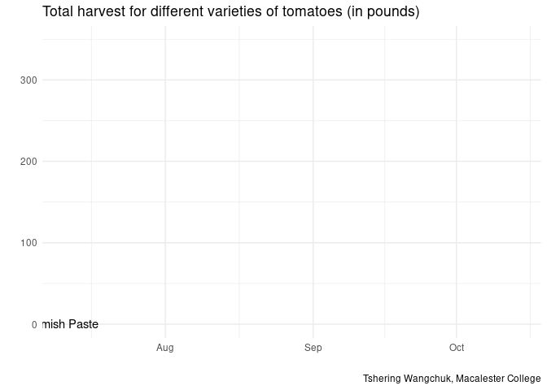
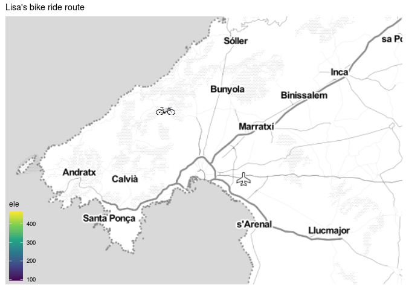
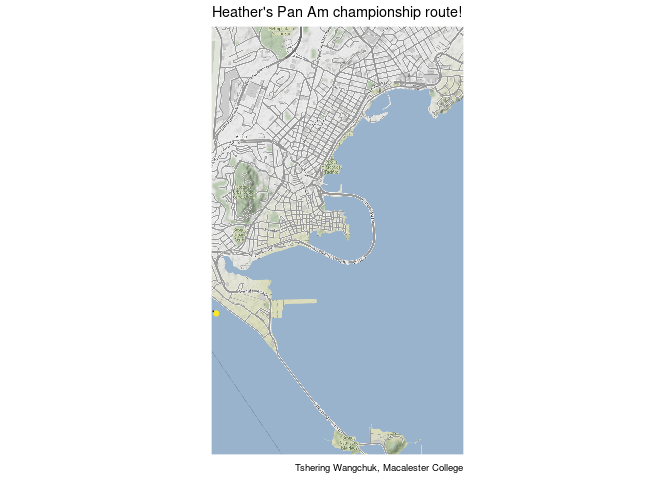
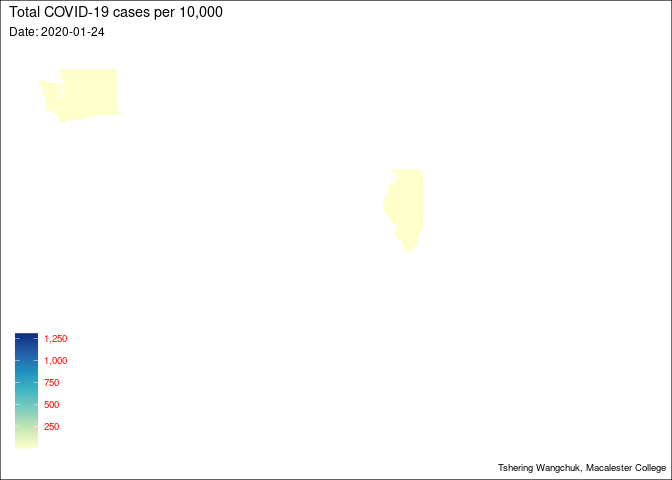

```r
library(tidyverse)     # for data cleaning and plotting
library(gardenR)       # for Lisa's garden data
library(lubridate)     # for date manipulation
library(openintro)     # for the abbr2state() function
library(palmerpenguins)# for Palmer penguin data
library(maps)          # for map data
library(ggmap)         # for mapping points on maps
library(gplots)        # for col2hex() function
library(RColorBrewer)  # for color palettes
library(sf)            # for working with spatial data
library(leaflet)       # for highly customizable mapping
library(ggthemes)      # for more themes (including theme_map())
library(plotly)        # for the ggplotly() - basic interactivity
library(gganimate)     # for adding animation layers to ggplots
library(transformr)    # for "tweening" (gganimate)
library(gifski)        # need the library for creating gifs but don't need to load each time
library(shiny)         # for creating interactive apps
library(ggimage)
theme_set(theme_minimal())
```


```r
# SNCF Train data
small_trains <- read_csv("https://raw.githubusercontent.com/rfordatascience/tidytuesday/master/data/2019/2019-02-26/small_trains.csv") 

# Lisa's garden data
data("garden_harvest")

# Lisa's Mallorca cycling data
mallorca_bike_day7 <- read_csv("https://www.dropbox.com/s/zc6jan4ltmjtvy0/mallorca_bike_day7.csv?dl=1") %>% 
  select(1:4, speed)

# Heather Lendway's Ironman 70.3 Pan Am championships Panama data
panama_swim <- read_csv("https://raw.githubusercontent.com/llendway/gps-data/master/data/panama_swim_20160131.csv")

panama_bike <- read_csv("https://raw.githubusercontent.com/llendway/gps-data/master/data/panama_bike_20160131.csv")

panama_run <- read_csv("https://raw.githubusercontent.com/llendway/gps-data/master/data/panama_run_20160131.csv")

#COVID-19 data from the New York Times
covid19 <- read_csv("https://raw.githubusercontent.com/nytimes/covid-19-data/master/us-states.csv")
```

## Put your homework on GitHub!

Go [here](https://github.com/llendway/github_for_collaboration/blob/master/github_for_collaboration.md) or to previous homework to remind yourself how to get set up. 

Once your repository is created, you should always open your **project** rather than just opening an .Rmd file. You can do that by either clicking on the .Rproj file in your repository folder on your computer. Or, by going to the upper right hand corner in R Studio and clicking the arrow next to where it says Project: (None). You should see your project come up in that list if you've used it recently. You could also go to File --> Open Project and navigate to your .Rproj file. 

## Instructions

* **NEW!!** With animated graphs, add `eval=FALSE` to the code chunk that creates the animation and saves it using `anim_save()`. Add another code chunk to reread the gif back into the file. See the [tutorial](https://animation-and-interactivity-in-r.netlify.app/) for help. 

* When you are finished with ALL the exercises, uncomment the options at the top so your document looks nicer. Don't do it before then, or else you might miss some important warnings and messages.

## Warm-up exercises from tutorial

  1. Choose 2 graphs you have created for ANY assignment in this class and add interactivity using the `ggplotly()` function.
  
<br> The plot below depicts the rise in COVID-19 cases across different regions in the U.S.,
  

```r
COVID <- covid19 %>% 
  filter(state %in% c("New York", "California", "Florida", "Illinois")) %>% 
  ggplot(aes(y = cases, x = date, color = state))+
  geom_line()+
  labs(y = "Number of Cases", x = "Date", title = "Cumulative COVID-19 Cases across the U.S.,")+
  scale_y_log10(labels = scales::comma)

ggplotly(
  p = COVID,
  width = NULL,
  height = NULL,
  tooltip = c("x", "y"),
  dynamicTicks = FALSE,
  layerData = 1,
  originalData = TRUE,
  source = "A"
)
```

<!--html_preserve--><div id="htmlwidget-b4ba7cabbe9d51e6fbea" style="width:672px;height:480px;" class="plotly html-widget"></div>
<script type="application/json" data-for="htmlwidget-b4ba7cabbe9d51e6fbea">{"x":{"data":[{"x":[18286,18287,18288,18289,18290,18291,18292,18293,18294,18295,18296,18297,18298,18299,18300,18301,18302,18303,18304,18305,18306,18307,18308,18309,18310,18311,18312,18313,18314,18315,18316,18317,18318,18319,18320,18321,18322,18323,18324,18325,18326,18327,18328,18329,18330,18331,18332,18333,18334,18335,18336,18337,18338,18339,18340,18341,18342,18343,18344,18345,18346,18347,18348,18349,18350,18351,18352,18353,18354,18355,18356,18357,18358,18359,18360,18361,18362,18363,18364,18365,18366,18367,18368,18369,18370,18371,18372,18373,18374,18375,18376,18377,18378,18379,18380,18381,18382,18383,18384,18385,18386,18387,18388,18389,18390,18391,18392,18393,18394,18395,18396,18397,18398,18399,18400,18401,18402,18403,18404,18405,18406,18407,18408,18409,18410,18411,18412,18413,18414,18415,18416,18417,18418,18419,18420,18421,18422,18423,18424,18425,18426,18427,18428,18429,18430,18431,18432,18433,18434,18435,18436,18437,18438,18439,18440,18441,18442,18443,18444,18445,18446,18447,18448,18449,18450,18451,18452,18453,18454,18455,18456,18457,18458,18459,18460,18461,18462,18463,18464,18465,18466,18467,18468,18469,18470,18471,18472,18473,18474,18475,18476,18477,18478,18479,18480,18481,18482,18483,18484,18485,18486,18487,18488,18489,18490,18491,18492,18493,18494,18495,18496,18497,18498,18499,18500,18501,18502,18503,18504,18505,18506,18507,18508,18509,18510,18511,18512,18513,18514,18515,18516,18517,18518,18519,18520,18521,18522,18523,18524,18525,18526,18527,18528,18529,18530,18531,18532,18533,18534,18535,18536,18537,18538,18539,18540,18541,18542,18543,18544,18545,18546,18547,18548,18549,18550,18551,18552,18553,18554,18555,18556,18557,18558,18559,18560,18561,18562,18563,18564,18565,18566,18567,18568,18569,18570,18571,18572,18573,18574,18575,18576,18577,18578,18579,18580,18581,18582,18583,18584,18585,18586,18587,18588,18589,18590,18591,18592,18593,18594,18595,18596,18597,18598,18599,18600,18601,18602,18603,18604,18605,18606,18607,18608,18609,18610,18611,18612,18613,18614,18615,18616,18617,18618,18619,18620,18621,18622,18623,18624,18625,18626,18627,18628,18629,18630,18631,18632,18633,18634,18635,18636,18637,18638,18639,18640,18641,18642,18643,18644,18645,18646,18647,18648,18649,18650,18651,18652,18653,18654,18655,18656,18657,18658,18659,18660,18661,18662,18663,18664,18665,18666,18667,18668,18669,18670,18671,18672,18673,18674,18675,18676,18677,18678,18679,18680],"y":[0,0.301029995663981,0.301029995663981,0.301029995663981,0.301029995663981,0.301029995663981,0.477121254719662,0.477121254719662,0.778151250383644,0.778151250383644,0.778151250383644,0.778151250383644,0.778151250383644,0.778151250383644,0.778151250383644,0.778151250383644,0.845098040014257,0.845098040014257,0.845098040014257,0.845098040014257,0.845098040014257,0.845098040014257,0.845098040014257,0.845098040014257,0.845098040014257,0.845098040014257,0.903089986991944,0.954242509439325,0.954242509439325,0.954242509439325,1.04139268515822,1.04139268515822,1.41497334797082,1.41497334797082,1.43136376415899,1.44715803134222,1.51851393987789,1.57978359661681,1.65321251377534,1.74036268949424,1.82607480270083,1.90848501887865,2,2.04921802267018,2.23552844690755,2.25285303097989,2.30535136944662,2.40140054078154,2.50514997831991,2.58092497567562,2.67942789661212,2.76937732607614,2.86451108105839,2.95085145888855,3.02816441942447,3.10822665637493,3.18864729599972,3.2674064187529,3.35024801833416,3.4222614508136,3.502836638621,3.60852603357719,3.69152352216815,3.74554320199802,3.80078579032776,3.87046243158892,3.93363911252493,3.99374475655446,4.04883008652835,4.09930072623346,4.13975318569535,4.1819007281964,4.2138098446415,4.24402958903002,4.2797353674105,4.30515782878649,4.3297232240579,4.35065497867808,4.36778441228115,4.38621350371676,4.41091213886308,4.43308145577526,4.4493549587028,4.46831778556491,4.48895943774871,4.49891676406517,4.52971260537695,4.55441646865175,4.57487587250364,4.59697075793118,4.61666452476401,4.62930764007375,4.64039198495932,4.65521529428984,4.66810623793273,4.68934438278172,4.70303330473369,4.71865113352788,4.73040270760322,4.74093084864747,4.75076288009657,4.76973170755798,4.78381071032645,4.79574797174963,4.81034006987327,4.8249324683978,4.83283451148338,4.84207227956051,4.8521749044203,4.86461786165523,4.8747542534682,4.88657531975417,4.89725860931349,4.90507235303412,4.91351185978305,4.92418104167482,4.93512923491568,4.94688437931772,4.95809063147362,4.96761816900762,4.97654713237439,4.98684784106319,4.99966981070592,5.0080590956377,5.01732972764134,5.02955827218373,5.04178731897175,5.05351636042029,5.063119349572,5.07218002243157,5.08065173586701,5.08961195201271,5.10212485573453,5.11108432225089,5.12056406076455,5.12803397170419,5.13749653154134,5.14655901414206,5.15748396735442,5.16815851908335,5.17734600343385,5.18455799959901,5.1921826061165,5.20175479195011,5.2132015499018,5.22306740569947,5.23259718902502,5.24267557177856,5.25238451670747,5.2662787466311,5.28112203612631,5.29201004919826,5.30408749822385,5.3160269888692,5.32521385110128,5.33636966344143,5.35023832415271,5.36577430021424,5.379783975364,5.39479827759598,5.40874521721681,5.42353421528618,5.43390897781985,5.44384009812711,5.45903948006388,5.4717375143427,5.48218159006879,5.49346502195821,5.50519069151918,5.51544463348105,5.52660545967942,5.53981978719477,5.55083594011798,5.5620083976656,5.57394092507952,5.58341870033529,5.59268739176616,5.60227165829826,5.61317137105095,5.62585549397818,5.63666338406744,5.64649782950404,5.65641158625879,5.66213237511019,5.66941265658186,5.67664880640948,5.68667111865579,5.69396337284976,5.70093983301487,5.70715015505587,5.71259667406372,5.71786597472074,5.72202317794115,5.72654465290713,5.73320770089295,5.73889308006784,5.74519818866881,5.75069657406516,5.75911386045725,5.76795541928654,5.77458776090716,5.78046997258643,5.78763259955478,5.79377711825804,5.79831080999929,5.80276756989349,5.80651845602478,5.81073106533239,5.81517979480754,5.81953801330401,5.82303384263748,5.82603850194348,5.83009828708219,5.83398810140205,5.83734344725921,5.84070941983144,5.84409739038119,5.84664571036389,5.84916687216409,5.85280985894225,5.85529377286153,5.85855825011597,5.86177210261619,5.86492085692137,5.8675105026856,5.8693684422809,5.87080699160823,5.87280460704372,5.87459544998648,5.87680478087912,5.87916758667136,5.88114547214285,5.88274589772243,5.88483046847265,5.8864439090882,5.88835811907459,5.89038971716971,5.89289341487598,5.89491170105476,5.89656865282125,5.89884415759235,5.90040919036182,5.90219332962692,5.90399617352158,5.90619115118831,5.90806338777913,5.90939447587959,5.91104888829304,5.91272091620039,5.91440927487581,5.91608846101974,5.91822121656005,5.91985911972957,5.92149659267877,5.92309888405402,5.92444573371285,5.92620452079131,5.92808025955014,5.9300459007187,5.9316114230877,5.93301933407861,5.93447774601308,5.93631967404369,5.93806618106146,5.93970890304639,5.94156161708338,5.94263150036043,5.94368936060352,5.94579590600477,5.94796915226645,5.94946465984146,5.95251347540434,5.95536299018561,5.95743679181677,5.95872820559832,5.96080314959742,5.96313920591827,5.96505110695153,5.9670296023304,5.96933482405489,5.97092678814542,5.9726114755246,5.97503685759171,5.97744145081578,5.97983234867316,5.98267096186141,5.98569451317737,5.98802400836601,5.9907134830824,5.99369981354007,5.99753534719573,5.99978192942979,6.00397164744935,6.00819634567165,6.0115772095735,6.01535179047599,6.02009598362791,6.02452507259412,6.02918769208428,6.03449770748933,6.0399694229768,6.045261938516,6.0486950034315,6.0555568294794,6.06183119061447,6.06712630227257,6.07045791262329,6.07666628942952,6.08144740726738,6.08618038014727,6.09243710308099,6.09825147251591,6.10450110957245,6.11189634942437,6.1199612097648,6.12812289971311,6.13733511848538,6.14586955355545,6.15394650419254,6.16352333501947,6.1734930808765,6.18417365899845,6.19169212907658,6.20158009036671,6.20974818415964,6.21882056509365,6.23452411676371,6.24584344459969,6.25757898764536,6.2664534925342,6.27642227927902,6.28625050155475,6.29411997530899,6.30388433303579,6.31131277527806,6.31485506469154,6.32831394456807,6.33590560498598,6.34418647546501,6.3508523140076,6.357077794125,6.36319233522628,6.37027728159125,6.37983523330328,6.38629166754749,6.39349816400164,6.39998885992312,6.4062836154527,6.41311376573226,6.42157332777158,6.42928140459733,6.43608707640799,6.44248995997063,6.44962231734634,6.45599946148018,6.46213899131528,6.46795954212152,6.4734820066707,6.47807319751943,6.48173019961762,6.48729664485143,6.49000612271091,6.49358504439177,6.49705798111003,6.50022714096277,6.50319287864641,6.506841514069,6.50975183294652,6.51224614596947,6.51485961550399,6.51747090803205,6.51977944454911,6.5216104490022,6.52390208278888,6.52556810817654,6.52719113208418,6.5290808788115,6.53087751390556,6.53235811150617,6.53365756133633,6.53538084366325,6.53670701151844,6.53779064470578,6.53911626289915,6.54031107633521,6.54145804889346,6.542200788538,6.54282492920018,6.54391415275714,6.54469198731266,6.5456634381727,6.54663654483613,6.54738428006093,6.54795601316453,6.5485670309803],"text":["date: 2020-01-25<br />cases:       1","date: 2020-01-26<br />cases:       2","date: 2020-01-27<br />cases:       2","date: 2020-01-28<br />cases:       2","date: 2020-01-29<br />cases:       2","date: 2020-01-30<br />cases:       2","date: 2020-01-31<br />cases:       3","date: 2020-02-01<br />cases:       3","date: 2020-02-02<br />cases:       6","date: 2020-02-03<br />cases:       6","date: 2020-02-04<br />cases:       6","date: 2020-02-05<br />cases:       6","date: 2020-02-06<br />cases:       6","date: 2020-02-07<br />cases:       6","date: 2020-02-08<br />cases:       6","date: 2020-02-09<br />cases:       6","date: 2020-02-10<br />cases:       7","date: 2020-02-11<br />cases:       7","date: 2020-02-12<br />cases:       7","date: 2020-02-13<br />cases:       7","date: 2020-02-14<br />cases:       7","date: 2020-02-15<br />cases:       7","date: 2020-02-16<br />cases:       7","date: 2020-02-17<br />cases:       7","date: 2020-02-18<br />cases:       7","date: 2020-02-19<br />cases:       7","date: 2020-02-20<br />cases:       8","date: 2020-02-21<br />cases:       9","date: 2020-02-22<br />cases:       9","date: 2020-02-23<br />cases:       9","date: 2020-02-24<br />cases:      11","date: 2020-02-25<br />cases:      11","date: 2020-02-26<br />cases:      26","date: 2020-02-27<br />cases:      26","date: 2020-02-28<br />cases:      27","date: 2020-02-29<br />cases:      28","date: 2020-03-01<br />cases:      33","date: 2020-03-02<br />cases:      38","date: 2020-03-03<br />cases:      45","date: 2020-03-04<br />cases:      55","date: 2020-03-05<br />cases:      67","date: 2020-03-06<br />cases:      81","date: 2020-03-07<br />cases:     100","date: 2020-03-08<br />cases:     112","date: 2020-03-09<br />cases:     172","date: 2020-03-10<br />cases:     179","date: 2020-03-11<br />cases:     202","date: 2020-03-12<br />cases:     252","date: 2020-03-13<br />cases:     320","date: 2020-03-14<br />cases:     381","date: 2020-03-15<br />cases:     478","date: 2020-03-16<br />cases:     588","date: 2020-03-17<br />cases:     732","date: 2020-03-18<br />cases:     893","date: 2020-03-19<br />cases:    1067","date: 2020-03-20<br />cases:    1283","date: 2020-03-21<br />cases:    1544","date: 2020-03-22<br />cases:    1851","date: 2020-03-23<br />cases:    2240","date: 2020-03-24<br />cases:    2644","date: 2020-03-25<br />cases:    3183","date: 2020-03-26<br />cases:    4060","date: 2020-03-27<br />cases:    4915","date: 2020-03-28<br />cases:    5566","date: 2020-03-29<br />cases:    6321","date: 2020-03-30<br />cases:    7421","date: 2020-03-31<br />cases:    8583","date: 2020-04-01<br />cases:    9857","date: 2020-04-02<br />cases:   11190","date: 2020-04-03<br />cases:   12569","date: 2020-04-04<br />cases:   13796","date: 2020-04-05<br />cases:   15202","date: 2020-04-06<br />cases:   16361","date: 2020-04-07<br />cases:   17540","date: 2020-04-08<br />cases:   19043","date: 2020-04-09<br />cases:   20191","date: 2020-04-10<br />cases:   21366","date: 2020-04-11<br />cases:   22421","date: 2020-04-12<br />cases:   23323","date: 2020-04-13<br />cases:   24334","date: 2020-04-14<br />cases:   25758","date: 2020-04-15<br />cases:   27107","date: 2020-04-16<br />cases:   28142","date: 2020-04-17<br />cases:   29398","date: 2020-04-18<br />cases:   30829","date: 2020-04-19<br />cases:   31544","date: 2020-04-20<br />cases:   33862","date: 2020-04-21<br />cases:   35844","date: 2020-04-22<br />cases:   37573","date: 2020-04-23<br />cases:   39534","date: 2020-04-24<br />cases:   41368","date: 2020-04-25<br />cases:   42590","date: 2020-04-26<br />cases:   43691","date: 2020-04-27<br />cases:   45208","date: 2020-04-28<br />cases:   46570","date: 2020-04-29<br />cases:   48904","date: 2020-04-30<br />cases:   50470","date: 2020-05-01<br />cases:   52318","date: 2020-05-02<br />cases:   53753","date: 2020-05-03<br />cases:   55072","date: 2020-05-04<br />cases:   56333","date: 2020-05-05<br />cases:   58848","date: 2020-05-06<br />cases:   60787","date: 2020-05-07<br />cases:   62481","date: 2020-05-08<br />cases:   64616","date: 2020-05-09<br />cases:   66824","date: 2020-05-10<br />cases:   68051","date: 2020-05-11<br />cases:   69514","date: 2020-05-12<br />cases:   71150","date: 2020-05-13<br />cases:   73218","date: 2020-05-14<br />cases:   74947","date: 2020-05-15<br />cases:   77015","date: 2020-05-16<br />cases:   78933","date: 2020-05-17<br />cases:   80366","date: 2020-05-18<br />cases:   81943","date: 2020-05-19<br />cases:   83981","date: 2020-05-20<br />cases:   86125","date: 2020-05-21<br />cases:   88488","date: 2020-05-22<br />cases:   90801","date: 2020-05-23<br />cases:   92815","date: 2020-05-24<br />cases:   94743","date: 2020-05-25<br />cases:   97017","date: 2020-05-26<br />cases:   99924","date: 2020-05-27<br />cases:  101873","date: 2020-05-28<br />cases:  104071","date: 2020-05-29<br />cases:  107043","date: 2020-05-30<br />cases:  110100","date: 2020-05-31<br />cases:  113114","date: 2020-06-01<br />cases:  115643","date: 2020-06-02<br />cases:  118081","date: 2020-06-03<br />cases:  120407","date: 2020-06-04<br />cases:  122917","date: 2020-06-05<br />cases:  126510","date: 2020-06-06<br />cases:  129147","date: 2020-06-07<br />cases:  131997","date: 2020-06-08<br />cases:  134287","date: 2020-06-09<br />cases:  137245","date: 2020-06-10<br />cases:  140139","date: 2020-06-11<br />cases:  143709","date: 2020-06-12<br />cases:  147285","date: 2020-06-13<br />cases:  150434","date: 2020-06-14<br />cases:  152953","date: 2020-06-15<br />cases:  155662","date: 2020-06-16<br />cases:  159131","date: 2020-06-17<br />cases:  163381","date: 2020-06-18<br />cases:  167135","date: 2020-06-19<br />cases:  170843","date: 2020-06-20<br />cases:  174854","date: 2020-06-21<br />cases:  178807","date: 2020-06-22<br />cases:  184620","date: 2020-06-23<br />cases:  191039","date: 2020-06-24<br />cases:  195889","date: 2020-06-25<br />cases:  201413","date: 2020-06-26<br />cases:  207027","date: 2020-06-27<br />cases:  211453","date: 2020-06-28<br />cases:  216955","date: 2020-06-29<br />cases:  223995","date: 2020-06-30<br />cases:  232153","date: 2020-07-01<br />cases:  239764","date: 2020-07-02<br />cases:  248198","date: 2020-07-03<br />cases:  256298","date: 2020-07-04<br />cases:  265176","date: 2020-07-05<br />cases:  271587","date: 2020-07-06<br />cases:  277869","date: 2020-07-07<br />cases:  287766","date: 2020-07-08<br />cases:  296304","date: 2020-07-09<br />cases:  303516","date: 2020-07-10<br />cases:  311505","date: 2020-07-11<br />cases:  320030","date: 2020-07-12<br />cases:  327676","date: 2020-07-13<br />cases:  336206","date: 2020-07-14<br />cases:  346593","date: 2020-07-15<br />cases:  355497","date: 2020-07-16<br />cases:  364761","date: 2020-07-17<br />cases:  374922","date: 2020-07-18<br />cases:  383194","date: 2020-07-19<br />cases:  391460","date: 2020-07-20<br />cases:  400195","date: 2020-07-21<br />cases:  410366","date: 2020-07-22<br />cases:  422528","date: 2020-07-23<br />cases:  433175","date: 2020-07-24<br />cases:  443096","date: 2020-07-25<br />cases:  453327","date: 2020-07-26<br />cases:  459338","date: 2020-07-27<br />cases:  467103","date: 2020-07-28<br />cases:  474951","date: 2020-07-29<br />cases:  486039","date: 2020-07-30<br />cases:  494269","date: 2020-07-31<br />cases:  502273","date: 2020-08-01<br />cases:  509507","date: 2020-08-02<br />cases:  515937","date: 2020-08-03<br />cases:  522235","date: 2020-08-04<br />cases:  527258","date: 2020-08-05<br />cases:  532776","date: 2020-08-06<br />cases:  541013","date: 2020-08-07<br />cases:  548142","date: 2020-08-08<br />cases:  556158","date: 2020-08-09<br />cases:  563244","date: 2020-08-10<br />cases:  574267","date: 2020-08-11<br />cases:  586078","date: 2020-08-12<br />cases:  595097","date: 2020-08-13<br />cases:  603212","date: 2020-08-14<br />cases:  613243","date: 2020-08-15<br />cases:  621981","date: 2020-08-16<br />cases:  628508","date: 2020-08-17<br />cases:  634991","date: 2020-08-18<br />cases:  640499","date: 2020-08-19<br />cases:  646742","date: 2020-08-20<br />cases:  653401","date: 2020-08-21<br />cases:  659991","date: 2020-08-22<br />cases:  665325","date: 2020-08-23<br />cases:  669944","date: 2020-08-24<br />cases:  676236","date: 2020-08-25<br />cases:  682320","date: 2020-08-26<br />cases:  687612","date: 2020-08-27<br />cases:  692962","date: 2020-08-28<br />cases:  698389","date: 2020-08-29<br />cases:  702499","date: 2020-08-30<br />cases:  706589","date: 2020-08-31<br />cases:  712541","date: 2020-09-01<br />cases:  716628","date: 2020-09-02<br />cases:  722035","date: 2020-09-03<br />cases:  727398","date: 2020-09-04<br />cases:  732691","date: 2020-09-05<br />cases:  737073","date: 2020-09-06<br />cases:  740233","date: 2020-09-07<br />cases:  742689","date: 2020-09-08<br />cases:  746113","date: 2020-09-09<br />cases:  749196","date: 2020-09-10<br />cases:  753017","date: 2020-09-11<br />cases:  757125","date: 2020-09-12<br />cases:  760581","date: 2020-09-13<br />cases:  763389","date: 2020-09-14<br />cases:  767062","date: 2020-09-15<br />cases:  769917","date: 2020-09-16<br />cases:  773318","date: 2020-09-17<br />cases:  776944","date: 2020-09-18<br />cases:  781436","date: 2020-09-19<br />cases:  785076","date: 2020-09-20<br />cases:  788077","date: 2020-09-21<br />cases:  792217","date: 2020-09-22<br />cases:  795077","date: 2020-09-23<br />cases:  798350","date: 2020-09-24<br />cases:  801671","date: 2020-09-25<br />cases:  805733","date: 2020-09-26<br />cases:  809214","date: 2020-09-27<br />cases:  811698","date: 2020-09-28<br />cases:  814796","date: 2020-09-29<br />cases:  817939","date: 2020-09-30<br />cases:  821125","date: 2020-10-01<br />cases:  824306","date: 2020-10-02<br />cases:  828364","date: 2020-10-03<br />cases:  831494","date: 2020-10-04<br />cases:  834635","date: 2020-10-05<br />cases:  837720","date: 2020-10-06<br />cases:  840322","date: 2020-10-07<br />cases:  843732","date: 2020-10-08<br />cases:  847384","date: 2020-10-09<br />cases:  851228","date: 2020-10-10<br />cases:  854302","date: 2020-10-11<br />cases:  857076","date: 2020-10-12<br />cases:  859959","date: 2020-10-13<br />cases:  863614","date: 2020-10-14<br />cases:  867094","date: 2020-10-15<br />cases:  870380","date: 2020-10-16<br />cases:  874101","date: 2020-10-17<br />cases:  876257","date: 2020-10-18<br />cases:  878394","date: 2020-10-19<br />cases:  882665","date: 2020-10-20<br />cases:  887093","date: 2020-10-21<br />cases:  890153","date: 2020-10-22<br />cases:  896424","date: 2020-10-23<br />cases:  902325","date: 2020-10-24<br />cases:  906644","date: 2020-10-25<br />cases:  909344","date: 2020-10-26<br />cases:  913699","date: 2020-10-27<br />cases:  918627","date: 2020-10-28<br />cases:  922680","date: 2020-10-29<br />cases:  926893","date: 2020-10-30<br />cases:  931826","date: 2020-10-31<br />cases:  935248","date: 2020-11-01<br />cases:  938883","date: 2020-11-02<br />cases:  944141","date: 2020-11-03<br />cases:  949383","date: 2020-11-04<br />cases:  954624","date: 2020-11-05<br />cases:  960884","date: 2020-11-06<br />cases:  967597","date: 2020-11-07<br />cases:  972801","date: 2020-11-08<br />cases:  978844","date: 2020-11-09<br />cases:  985598","date: 2020-11-10<br />cases:  994341","date: 2020-11-11<br />cases:  999498","date: 2020-11-12<br />cases: 1009187","date: 2020-11-13<br />cases: 1019052","date: 2020-11-14<br />cases: 1027016","date: 2020-11-15<br />cases: 1035981","date: 2020-11-16<br />cases: 1047360","date: 2020-11-17<br />cases: 1058096","date: 2020-11-18<br />cases: 1069517","date: 2020-11-19<br />cases: 1082674","date: 2020-11-20<br />cases: 1096401","date: 2020-11-21<br />cases: 1109844","date: 2020-11-22<br />cases: 1118652","date: 2020-11-23<br />cases: 1136467","date: 2020-11-24<br />cases: 1153005","date: 2020-11-25<br />cases: 1167149","date: 2020-11-26<br />cases: 1176137","date: 2020-11-27<br />cases: 1193071","date: 2020-11-28<br />cases: 1206278","date: 2020-11-29<br />cases: 1219496","date: 2020-11-30<br />cases: 1237192","date: 2020-12-01<br />cases: 1253867","date: 2020-12-02<br />cases: 1272041","date: 2020-12-03<br />cases: 1293887","date: 2020-12-04<br />cases: 1318139","date: 2020-12-05<br />cases: 1343145","date: 2020-12-06<br />cases: 1371940","date: 2020-12-07<br />cases: 1399167","date: 2020-12-08<br />cases: 1425432","date: 2020-12-09<br />cases: 1457214","date: 2020-12-10<br />cases: 1491053","date: 2020-12-11<br />cases: 1528177","date: 2020-12-12<br />cases: 1554863","date: 2020-12-13<br />cases: 1590670","date: 2020-12-14<br />cases: 1620870","date: 2020-12-15<br />cases: 1655086","date: 2020-12-16<br />cases: 1716027","date: 2020-12-17<br />cases: 1761341","date: 2020-12-18<br />cases: 1809585","date: 2020-12-19<br />cases: 1846943","date: 2020-12-20<br />cases: 1889828","date: 2020-12-21<br />cases: 1933083","date: 2020-12-22<br />cases: 1968430","date: 2020-12-23<br />cases: 2013188","date: 2020-12-24<br />cases: 2047919","date: 2020-12-25<br />cases: 2064691","date: 2020-12-26<br />cases: 2129678","date: 2020-12-27<br />cases: 2167233","date: 2020-12-28<br />cases: 2208953","date: 2020-12-29<br />cases: 2243119","date: 2020-12-30<br />cases: 2275505","date: 2020-12-31<br />cases: 2307769","date: 2021-01-01<br />cases: 2345726","date: 2021-01-02<br />cases: 2397923","date: 2021-01-03<br />cases: 2433838","date: 2021-01-04<br />cases: 2474561","date: 2021-01-05<br />cases: 2511822","date: 2021-01-06<br />cases: 2548494","date: 2021-01-07<br />cases: 2588891","date: 2021-01-08<br />cases: 2639814","date: 2021-01-09<br />cases: 2687085","date: 2021-01-10<br />cases: 2729525","date: 2021-01-11<br />cases: 2770065","date: 2021-01-12<br />cases: 2815933","date: 2021-01-13<br />cases: 2857587","date: 2021-01-14<br />cases: 2898271","date: 2021-01-15<br />cases: 2937376","date: 2021-01-16<br />cases: 2974966","date: 2021-01-17<br />cases: 3006583","date: 2021-01-18<br />cases: 3032007","date: 2021-01-19<br />cases: 3071119","date: 2021-01-20<br />cases: 3090339","date: 2021-01-21<br />cases: 3115911","date: 2021-01-22<br />cases: 3140928","date: 2021-01-23<br />cases: 3163932","date: 2021-01-24<br />cases: 3185612","date: 2021-01-25<br />cases: 3212488","date: 2021-01-26<br />cases: 3234088","date: 2021-01-27<br />cases: 3252716","date: 2021-01-28<br />cases: 3272349","date: 2021-01-29<br />cases: 3292084","date: 2021-01-30<br />cases: 3309630","date: 2021-01-31<br />cases: 3323613","date: 2021-02-01<br />cases: 3341197","date: 2021-02-02<br />cases: 3354039","date: 2021-02-03<br />cases: 3366597","date: 2021-02-04<br />cases: 3381278","date: 2021-02-05<br />cases: 3395295","date: 2021-02-06<br />cases: 3406890","date: 2021-02-07<br />cases: 3417099","date: 2021-02-08<br />cases: 3430685","date: 2021-02-09<br />cases: 3441177","date: 2021-02-10<br />cases: 3449774","date: 2021-02-11<br />cases: 3460320","date: 2021-02-12<br />cases: 3469853","date: 2021-02-13<br />cases: 3479029","date: 2021-02-14<br />cases: 3484984","date: 2021-02-15<br />cases: 3489996","date: 2021-02-16<br />cases: 3498760","date: 2021-02-17<br />cases: 3505032","date: 2021-02-18<br />cases: 3512881","date: 2021-02-19<br />cases: 3520761","date: 2021-02-20<br />cases: 3526828","date: 2021-02-21<br />cases: 3531474","date: 2021-02-22<br />cases: 3536446"],"type":"scatter","mode":"lines","line":{"width":1.88976377952756,"color":"rgba(248,118,109,1)","dash":"solid"},"hoveron":"points","name":"California","legendgroup":"California","showlegend":true,"xaxis":"x","yaxis":"y","hoverinfo":"text","frame":null},{"x":[18322,18323,18324,18325,18326,18327,18328,18329,18330,18331,18332,18333,18334,18335,18336,18337,18338,18339,18340,18341,18342,18343,18344,18345,18346,18347,18348,18349,18350,18351,18352,18353,18354,18355,18356,18357,18358,18359,18360,18361,18362,18363,18364,18365,18366,18367,18368,18369,18370,18371,18372,18373,18374,18375,18376,18377,18378,18379,18380,18381,18382,18383,18384,18385,18386,18387,18388,18389,18390,18391,18392,18393,18394,18395,18396,18397,18398,18399,18400,18401,18402,18403,18404,18405,18406,18407,18408,18409,18410,18411,18412,18413,18414,18415,18416,18417,18418,18419,18420,18421,18422,18423,18424,18425,18426,18427,18428,18429,18430,18431,18432,18433,18434,18435,18436,18437,18438,18439,18440,18441,18442,18443,18444,18445,18446,18447,18448,18449,18450,18451,18452,18453,18454,18455,18456,18457,18458,18459,18460,18461,18462,18463,18464,18465,18466,18467,18468,18469,18470,18471,18472,18473,18474,18475,18476,18477,18478,18479,18480,18481,18482,18483,18484,18485,18486,18487,18488,18489,18490,18491,18492,18493,18494,18495,18496,18497,18498,18499,18500,18501,18502,18503,18504,18505,18506,18507,18508,18509,18510,18511,18512,18513,18514,18515,18516,18517,18518,18519,18520,18521,18522,18523,18524,18525,18526,18527,18528,18529,18530,18531,18532,18533,18534,18535,18536,18537,18538,18539,18540,18541,18542,18543,18544,18545,18546,18547,18548,18549,18550,18551,18552,18553,18554,18555,18556,18557,18558,18559,18560,18561,18562,18563,18564,18565,18566,18567,18568,18569,18570,18571,18572,18573,18574,18575,18576,18577,18578,18579,18580,18581,18582,18583,18584,18585,18586,18587,18588,18589,18590,18591,18592,18593,18594,18595,18596,18597,18598,18599,18600,18601,18602,18603,18604,18605,18606,18607,18608,18609,18610,18611,18612,18613,18614,18615,18616,18617,18618,18619,18620,18621,18622,18623,18624,18625,18626,18627,18628,18629,18630,18631,18632,18633,18634,18635,18636,18637,18638,18639,18640,18641,18642,18643,18644,18645,18646,18647,18648,18649,18650,18651,18652,18653,18654,18655,18656,18657,18658,18659,18660,18661,18662,18663,18664,18665,18666,18667,18668,18669,18670,18671,18672,18673,18674,18675,18676,18677,18678,18679,18680],"y":[0.301029995663981,0.301029995663981,0.477121254719662,0.477121254719662,0.602059991327962,0.845098040014257,1.07918124604762,1.11394335230684,1.14612803567824,1.36172783601759,1.41497334797082,1.66275783168157,1.84509804001426,1.84509804001426,2.03742649794062,2.14921911265538,2.32221929473392,2.51321760006794,2.63748972951251,2.75127910398334,2.88309335857569,3,3.08707120590654,3.16643011384328,3.29468662427944,3.39410130204004,3.50487845941022,3.60616631460762,3.69399061046078,3.75549372841512,3.82878874818495,3.89036512144812,3.95424250943932,4.0111473607758,4.06209289263017,4.09138554207837,4.13420899293208,4.16846801885448,4.19562294358694,4.22580017057054,4.25430633233129,4.27825044229937,4.2978698913999,4.32244672276039,4.33485568961729,4.35268407977727,4.36795196775798,4.39348745814717,4.40626759641,4.42005481577876,4.43216726944259,4.4449967002677,4.45180178134793,4.47187819930729,4.48465567261692,4.48898761124739,4.49858620881752,4.50691072555152,4.51637669852615,4.52094182197806,4.52741076529266,4.54057971650445,4.54967748971056,4.55714614231836,4.56689688237865,4.57323142980426,4.57971501838967,4.58905553105234,4.59318634510457,4.60198398314272,4.60839765170251,4.61250836310205,4.62236947049474,4.62730439547766,4.63550385257552,4.64473392744719,4.65130709524422,4.65877432084436,4.66683609704334,4.67150607520828,4.67635518525656,4.68723457567433,4.69410481410176,4.70000239714225,4.70636781673722,4.71380963648428,4.71806135849887,4.72120036139205,4.72653976195565,4.73630883766247,4.74363517462878,4.74938843158115,4.75451651579448,4.75920687033135,4.76905222215807,4.77941609894707,4.78873385882771,4.79761373015308,4.80570470443386,4.8122179289812,4.81949129059582,4.8284214201548,4.83923286262244,4.85103196725075,4.86654724710865,4.8782919492498,4.88828061152054,4.90363793795404,4.91756327160353,4.93408415896217,4.95298606519706,4.97215190533601,4.98803695484968,5.00090672826585,5.01491936887639,5.03745040340095,5.05694294567288,5.08973559758795,5.1223371360288,5.14942543052195,5.16534227624005,5.18305905291854,5.2013670777509,5.22813847102707,5.25184740997771,5.27885416276825,5.30125359974905,5.31479174666059,5.32997926157517,5.3498115658004,5.36681504616385,5.3876442768284,5.40569290602746,5.43104677438037,5.45090621288435,5.46481879487136,5.47972211345841,5.49936674104035,5.51485709388447,5.52835226478066,5.544116434468,5.55676791149448,5.56799744024554,5.57933878850258,5.5909086784544,5.60455435066545,5.61752767814017,5.62720911355666,5.6362260371482,5.64539180871315,5.65457598608644,5.66405029296837,5.67244700120151,5.68125933260202,5.68763952725355,5.69185563263893,5.69663767151308,5.70133566603938,5.70789449849378,5.71438592933722,5.72145528787823,5.72656258592464,5.7299362731596,5.73462703719307,5.74106725398398,5.74595576519464,5.7507220182742,5.75559209126675,5.75846374778664,5.76048732116191,5.76337108228138,5.76644184868649,5.76981583068209,5.77325824408033,5.7764025946921,5.7785585723005,5.78018837308065,5.78210984396164,5.78441329033988,5.7867393582424,5.78943827405991,5.79168714097298,5.79349563473802,5.79481068496351,5.80005138312851,5.8017013707127,5.80414284122685,5.80631770492275,5.8087907707348,5.81051680042027,5.81174989481859,5.81296947722665,5.81434083913784,5.8160575976772,5.81847201207139,5.82057120793328,5.82215892246012,5.82329290924359,5.8253209395528,5.82684741850416,5.828948471156,5.83100672442797,5.83329057758008,5.83489479867164,5.83596374238227,5.83752594078289,5.83915802226902,5.84075328815086,5.84253373070147,5.84427458200255,5.84544285699355,5.8459001232592,5.84791798333516,5.84911708385787,5.85072953332897,5.85235554311878,5.85405268008079,5.85518649318792,5.85604338450449,5.85740306355115,5.85895745378431,5.86093961169862,5.86267569584242,5.86267569584242,5.86598174826564,5.86688725541927,5.86849220295984,5.87018377574662,5.87214461367953,5.87415060712296,5.87649092132717,5.87795385426809,5.87893463854212,5.88103125640718,5.88225408694874,5.88540815296682,5.88748901825445,5.88999769682382,5.89133001719212,5.89320952986991,5.89558993264319,5.89785682177651,5.90015730554914,5.90320288888063,5.90446614646413,5.90709089663935,5.90958544474313,5.91205830142801,5.91440398582571,5.91770081937403,5.92044527387098,5.92276125857169,5.92628532594111,5.92830007156811,5.93052420258569,5.93348931252689,5.93631816540012,5.93979072660129,5.94205172844257,5.94703797092016,5.94931973308848,5.95294492771173,5.95676373595377,5.96110059465974,5.96539457340042,5.96933156156512,5.97239077591753,5.97531092454554,5.97922594845021,5.98302516491307,5.98302516491307,5.99078801509409,5.99356363425023,5.99679702194083,5.99970066797024,6.00352860071155,6.0078126187016,6.01242465987076,6.01669872015245,6.02103623499678,6.02451275894851,6.02766634371418,6.03090803039428,6.03477039118261,6.03929075409116,6.04390745672341,6.04803956474944,6.05150869085409,6.05475664671621,6.05834477645619,6.06270492292605,6.06761942491978,6.07242453639842,6.0766975935006,6.07974473932801,6.08370789370139,6.08742894277028,6.09145274660614,6.09605378310422,6.09605378310422,6.10194630893511,6.10447720983162,6.10726730630615,6.11134452437779,6.11598141711259,6.12166060982546,6.12166060982546,6.13188320189485,6.13526880441928,6.13883426501686,6.14367511300621,6.14918769447134,6.15524916988163,6.16114151102847,6.16574541996507,6.16938108338803,6.17277159617594,6.17709592212449,6.18111839675764,6.1850273823267,6.18978750859891,6.19317414964151,6.19625109506835,6.19845721053101,6.20114822139018,6.20439214571207,6.2078701632333,6.21154634702313,6.21481895484569,6.21733678557842,6.21962669630892,6.22213225135979,6.22431624971098,6.2272659138727,6.23008140387985,6.23390463810443,6.23587397752463,6.23731723271593,6.23995780589186,6.24169860643182,6.243613913461,6.24646534270132,6.24830462683611,6.24992565008842,6.25132473406042,6.25303132200041,6.25485538214961,6.25690936078878,6.25873638823755,6.2605314486474,6.26182530249956,6.26268360048025,6.26417463834307,6.26590667765785,6.26710974898426,6.26867600466885,6.27037577218385,6.27155445923371,6.27251806788852],"text":["date: 2020-03-01<br />cases:       2","date: 2020-03-02<br />cases:       2","date: 2020-03-03<br />cases:       3","date: 2020-03-04<br />cases:       3","date: 2020-03-05<br />cases:       4","date: 2020-03-06<br />cases:       7","date: 2020-03-07<br />cases:      12","date: 2020-03-08<br />cases:      13","date: 2020-03-09<br />cases:      14","date: 2020-03-10<br />cases:      23","date: 2020-03-11<br />cases:      26","date: 2020-03-12<br />cases:      46","date: 2020-03-13<br />cases:      70","date: 2020-03-14<br />cases:      70","date: 2020-03-15<br />cases:     109","date: 2020-03-16<br />cases:     141","date: 2020-03-17<br />cases:     210","date: 2020-03-18<br />cases:     326","date: 2020-03-19<br />cases:     434","date: 2020-03-20<br />cases:     564","date: 2020-03-21<br />cases:     764","date: 2020-03-22<br />cases:    1000","date: 2020-03-23<br />cases:    1222","date: 2020-03-24<br />cases:    1467","date: 2020-03-25<br />cases:    1971","date: 2020-03-26<br />cases:    2478","date: 2020-03-27<br />cases:    3198","date: 2020-03-28<br />cases:    4038","date: 2020-03-29<br />cases:    4943","date: 2020-03-30<br />cases:    5695","date: 2020-03-31<br />cases:    6742","date: 2020-04-01<br />cases:    7769","date: 2020-04-02<br />cases:    9000","date: 2020-04-03<br />cases:   10260","date: 2020-04-04<br />cases:   11537","date: 2020-04-05<br />cases:   12342","date: 2020-04-06<br />cases:   13621","date: 2020-04-07<br />cases:   14739","date: 2020-04-08<br />cases:   15690","date: 2020-04-09<br />cases:   16819","date: 2020-04-10<br />cases:   17960","date: 2020-04-11<br />cases:   18978","date: 2020-04-12<br />cases:   19855","date: 2020-04-13<br />cases:   21011","date: 2020-04-14<br />cases:   21620","date: 2020-04-15<br />cases:   22526","date: 2020-04-16<br />cases:   23332","date: 2020-04-17<br />cases:   24745","date: 2020-04-18<br />cases:   25484","date: 2020-04-19<br />cases:   26306","date: 2020-04-20<br />cases:   27050","date: 2020-04-21<br />cases:   27861","date: 2020-04-22<br />cases:   28301","date: 2020-04-23<br />cases:   29640","date: 2020-04-24<br />cases:   30525","date: 2020-04-25<br />cases:   30831","date: 2020-04-26<br />cases:   31520","date: 2020-04-27<br />cases:   32130","date: 2020-04-28<br />cases:   32838","date: 2020-04-29<br />cases:   33185","date: 2020-04-30<br />cases:   33683","date: 2020-05-01<br />cases:   34720","date: 2020-05-02<br />cases:   35455","date: 2020-05-03<br />cases:   36070","date: 2020-05-04<br />cases:   36889","date: 2020-05-05<br />cases:   37431","date: 2020-05-06<br />cases:   37994","date: 2020-05-07<br />cases:   38820","date: 2020-05-08<br />cases:   39191","date: 2020-05-09<br />cases:   39993","date: 2020-05-10<br />cases:   40588","date: 2020-05-11<br />cases:   40974","date: 2020-05-12<br />cases:   41915","date: 2020-05-13<br />cases:   42394","date: 2020-05-14<br />cases:   43202","date: 2020-05-15<br />cases:   44130","date: 2020-05-16<br />cases:   44803","date: 2020-05-17<br />cases:   45580","date: 2020-05-18<br />cases:   46434","date: 2020-05-19<br />cases:   46936","date: 2020-05-20<br />cases:   47463","date: 2020-05-21<br />cases:   48667","date: 2020-05-22<br />cases:   49443","date: 2020-05-23<br />cases:   50119","date: 2020-05-24<br />cases:   50859","date: 2020-05-25<br />cases:   51738","date: 2020-05-26<br />cases:   52247","date: 2020-05-27<br />cases:   52626","date: 2020-05-28<br />cases:   53277","date: 2020-05-29<br />cases:   54489","date: 2020-05-30<br />cases:   55416","date: 2020-05-31<br />cases:   56155","date: 2020-06-01<br />cases:   56822","date: 2020-06-02<br />cases:   57439","date: 2020-06-03<br />cases:   58756","date: 2020-06-04<br />cases:   60175","date: 2020-06-05<br />cases:   61480","date: 2020-06-06<br />cases:   62750","date: 2020-06-07<br />cases:   63930","date: 2020-06-08<br />cases:   64896","date: 2020-06-09<br />cases:   65992","date: 2020-06-10<br />cases:   67363","date: 2020-06-11<br />cases:   69061","date: 2020-06-12<br />cases:   70963","date: 2020-06-13<br />cases:   73544","date: 2020-06-14<br />cases:   75560","date: 2020-06-15<br />cases:   77318","date: 2020-06-16<br />cases:   80101","date: 2020-06-17<br />cases:   82711","date: 2020-06-18<br />cases:   85918","date: 2020-06-19<br />cases:   89740","date: 2020-06-20<br />cases:   93789","date: 2020-06-21<br />cases:   97283","date: 2020-06-22<br />cases:  100209","date: 2020-06-23<br />cases:  103495","date: 2020-06-24<br />cases:  109006","date: 2020-06-25<br />cases:  114010","date: 2020-06-26<br />cases:  122952","date: 2020-06-27<br />cases:  132537","date: 2020-06-28<br />cases:  141067","date: 2020-06-29<br />cases:  146333","date: 2020-06-30<br />cases:  152426","date: 2020-07-01<br />cases:  158989","date: 2020-07-02<br />cases:  169098","date: 2020-07-03<br />cases:  178586","date: 2020-07-04<br />cases:  190044","date: 2020-07-05<br />cases:  200103","date: 2020-07-06<br />cases:  206439","date: 2020-07-07<br />cases:  213786","date: 2020-07-08<br />cases:  223775","date: 2020-07-09<br />cases:  232710","date: 2020-07-10<br />cases:  244143","date: 2020-07-11<br />cases:  254503","date: 2020-07-12<br />cases:  269803","date: 2020-07-13<br />cases:  282427","date: 2020-07-14<br />cases:  291621","date: 2020-07-15<br />cases:  301802","date: 2020-07-16<br />cases:  315767","date: 2020-07-17<br />cases:  327233","date: 2020-07-18<br />cases:  337561","date: 2020-07-19<br />cases:  350039","date: 2020-07-20<br />cases:  360386","date: 2020-07-21<br />cases:  369826","date: 2020-07-22<br />cases:  379611","date: 2020-07-23<br />cases:  389860","date: 2020-07-24<br />cases:  402304","date: 2020-07-25<br />cases:  414503","date: 2020-07-26<br />cases:  423847","date: 2020-07-27<br />cases:  432739","date: 2020-07-28<br />cases:  441969","date: 2020-07-29<br />cases:  451415","date: 2020-07-30<br />cases:  461371","date: 2020-07-31<br />cases:  470378","date: 2020-08-01<br />cases:  480020","date: 2020-08-02<br />cases:  487124","date: 2020-08-03<br />cases:  491876","date: 2020-08-04<br />cases:  497322","date: 2020-08-05<br />cases:  502731","date: 2020-08-06<br />cases:  510381","date: 2020-08-07<br />cases:  518067","date: 2020-08-08<br />cases:  526569","date: 2020-08-09<br />cases:  532798","date: 2020-08-10<br />cases:  536953","date: 2020-08-11<br />cases:  542784","date: 2020-08-12<br />cases:  550893","date: 2020-08-13<br />cases:  557129","date: 2020-08-14<br />cases:  563277","date: 2020-08-15<br />cases:  569629","date: 2020-08-16<br />cases:  573408","date: 2020-08-17<br />cases:  576086","date: 2020-08-18<br />cases:  579924","date: 2020-08-19<br />cases:  584039","date: 2020-08-20<br />cases:  588594","date: 2020-08-21<br />cases:  593278","date: 2020-08-22<br />cases:  597589","date: 2020-08-23<br />cases:  600563","date: 2020-08-24<br />cases:  602821","date: 2020-08-25<br />cases:  605494","date: 2020-08-26<br />cases:  608714","date: 2020-08-27<br />cases:  611983","date: 2020-08-28<br />cases:  615798","date: 2020-08-29<br />cases:  618995","date: 2020-08-30<br />cases:  621578","date: 2020-08-31<br />cases:  623463","date: 2020-09-01<br />cases:  631032","date: 2020-09-02<br />cases:  633434","date: 2020-09-03<br />cases:  637005","date: 2020-09-04<br />cases:  640203","date: 2020-09-05<br />cases:  643859","date: 2020-09-06<br />cases:  646423","date: 2020-09-07<br />cases:  648261","date: 2020-09-08<br />cases:  650084","date: 2020-09-09<br />cases:  652140","date: 2020-09-10<br />cases:  654723","date: 2020-09-11<br />cases:  658373","date: 2020-09-12<br />cases:  661563","date: 2020-09-13<br />cases:  663986","date: 2020-09-14<br />cases:  665722","date: 2020-09-15<br />cases:  668838","date: 2020-09-16<br />cases:  671193","date: 2020-09-17<br />cases:  674448","date: 2020-09-18<br />cases:  677652","date: 2020-09-19<br />cases:  681225","date: 2020-09-20<br />cases:  683746","date: 2020-09-21<br />cases:  685431","date: 2020-09-22<br />cases:  687901","date: 2020-09-23<br />cases:  690491","date: 2020-09-24<br />cases:  693032","date: 2020-09-25<br />cases:  695879","date: 2020-09-26<br />cases:  698674","date: 2020-09-27<br />cases:  700556","date: 2020-09-28<br />cases:  701294","date: 2020-09-29<br />cases:  704560","date: 2020-09-30<br />cases:  706508","date: 2020-10-01<br />cases:  709136","date: 2020-10-02<br />cases:  711796","date: 2020-10-03<br />cases:  714583","date: 2020-10-04<br />cases:  716451","date: 2020-10-05<br />cases:  717866","date: 2020-10-06<br />cases:  720117","date: 2020-10-07<br />cases:  722699","date: 2020-10-08<br />cases:  726005","date: 2020-10-09<br />cases:  728913","date: 2020-10-10<br />cases:  728913","date: 2020-10-11<br />cases:  734483","date: 2020-10-12<br />cases:  736016","date: 2020-10-13<br />cases:  738741","date: 2020-10-14<br />cases:  741624","date: 2020-10-15<br />cases:  744980","date: 2020-10-16<br />cases:  748429","date: 2020-10-17<br />cases:  752473","date: 2020-10-18<br />cases:  755012","date: 2020-10-19<br />cases:  756719","date: 2020-10-20<br />cases:  760381","date: 2020-10-21<br />cases:  762525","date: 2020-10-22<br />cases:  768083","date: 2020-10-23<br />cases:  771772","date: 2020-10-24<br />cases:  776243","date: 2020-10-25<br />cases:  778628","date: 2020-10-26<br />cases:  782005","date: 2020-10-27<br />cases:  786303","date: 2020-10-28<br />cases:  790418","date: 2020-10-29<br />cases:  794616","date: 2020-10-30<br />cases:  800208","date: 2020-10-31<br />cases:  802539","date: 2020-11-01<br />cases:  807404","date: 2020-11-02<br />cases:  812055","date: 2020-11-03<br />cases:  816692","date: 2020-11-04<br />cases:  821115","date: 2020-11-05<br />cases:  827372","date: 2020-11-06<br />cases:  832617","date: 2020-11-07<br />cases:  837069","date: 2020-11-08<br />cases:  843889","date: 2020-11-09<br />cases:  847813","date: 2020-11-10<br />cases:  852166","date: 2020-11-11<br />cases:  858004","date: 2020-11-12<br />cases:  863611","date: 2020-11-13<br />cases:  870544","date: 2020-11-14<br />cases:  875088","date: 2020-11-15<br />cases:  885193","date: 2020-11-16<br />cases:  889856","date: 2020-11-17<br />cases:  897315","date: 2020-11-18<br />cases:  905240","date: 2020-11-19<br />cases:  914325","date: 2020-11-20<br />cases:  923410","date: 2020-11-21<br />cases:  931819","date: 2020-11-22<br />cases:  938406","date: 2020-11-23<br />cases:  944737","date: 2020-11-24<br />cases:  953292","date: 2020-11-25<br />cases:  961668","date: 2020-11-26<br />cases:  961668","date: 2020-11-27<br />cases:  979012","date: 2020-11-28<br />cases:  985289","date: 2020-11-29<br />cases:  992652","date: 2020-11-30<br />cases:  999311","date: 2020-12-01<br />cases: 1008158","date: 2020-12-02<br />cases: 1018152","date: 2020-12-03<br />cases: 1029022","date: 2020-12-04<br />cases: 1039199","date: 2020-12-05<br />cases: 1049630","date: 2020-12-06<br />cases: 1058066","date: 2020-12-07<br />cases: 1065777","date: 2020-12-08<br />cases: 1073762","date: 2020-12-09<br />cases: 1083354","date: 2020-12-10<br />cases: 1094689","date: 2020-12-11<br />cases: 1106388","date: 2020-12-12<br />cases: 1116965","date: 2020-12-13<br />cases: 1125923","date: 2020-12-14<br />cases: 1134375","date: 2020-12-15<br />cases: 1143786","date: 2020-12-16<br />cases: 1155327","date: 2020-12-17<br />cases: 1168475","date: 2020-12-18<br />cases: 1181475","date: 2020-12-19<br />cases: 1193157","date: 2020-12-20<br />cases: 1201558","date: 2020-12-21<br />cases: 1212573","date: 2020-12-22<br />cases: 1223007","date: 2020-12-23<br />cases: 1234391","date: 2020-12-24<br />cases: 1247538","date: 2020-12-25<br />cases: 1247538","date: 2020-12-26<br />cases: 1264580","date: 2020-12-27<br />cases: 1271971","date: 2020-12-28<br />cases: 1280169","date: 2020-12-29<br />cases: 1292244","date: 2020-12-30<br />cases: 1306115","date: 2020-12-31<br />cases: 1323307","date: 2021-01-01<br />cases: 1323307","date: 2021-01-02<br />cases: 1354825","date: 2021-01-03<br />cases: 1365428","date: 2021-01-04<br />cases: 1376684","date: 2021-01-05<br />cases: 1392115","date: 2021-01-06<br />cases: 1409898","date: 2021-01-07<br />cases: 1429714","date: 2021-01-08<br />cases: 1449244","date: 2021-01-09<br />cases: 1464689","date: 2021-01-10<br />cases: 1477002","date: 2021-01-11<br />cases: 1488578","date: 2021-01-12<br />cases: 1503474","date: 2021-01-13<br />cases: 1517464","date: 2021-01-14<br />cases: 1531184","date: 2021-01-15<br />cases: 1548059","date: 2021-01-16<br />cases: 1560178","date: 2021-01-17<br />cases: 1571271","date: 2021-01-18<br />cases: 1579273","date: 2021-01-19<br />cases: 1589089","date: 2021-01-20<br />cases: 1601003","date: 2021-01-21<br />cases: 1613876","date: 2021-01-22<br />cases: 1627595","date: 2021-01-23<br />cases: 1639906","date: 2021-01-24<br />cases: 1649441","date: 2021-01-25<br />cases: 1658161","date: 2021-01-26<br />cases: 1667755","date: 2021-01-27<br />cases: 1676163","date: 2021-01-28<br />cases: 1687586","date: 2021-01-29<br />cases: 1698562","date: 2021-01-30<br />cases: 1713581","date: 2021-01-31<br />cases: 1721369","date: 2021-02-01<br />cases: 1727099","date: 2021-02-02<br />cases: 1737632","date: 2021-02-03<br />cases: 1744611","date: 2021-02-04<br />cases: 1752322","date: 2021-02-05<br />cases: 1763865","date: 2021-02-06<br />cases: 1771351","date: 2021-02-07<br />cases: 1777975","date: 2021-02-08<br />cases: 1783712","date: 2021-02-09<br />cases: 1790735","date: 2021-02-10<br />cases: 1798272","date: 2021-02-11<br />cases: 1806797","date: 2021-02-12<br />cases: 1814414","date: 2021-02-13<br />cases: 1821929","date: 2021-02-14<br />cases: 1827365","date: 2021-02-15<br />cases: 1830980","date: 2021-02-16<br />cases: 1837277","date: 2021-02-17<br />cases: 1844619","date: 2021-02-18<br />cases: 1849736","date: 2021-02-19<br />cases: 1856419","date: 2021-02-20<br />cases: 1863699","date: 2021-02-21<br />cases: 1868764","date: 2021-02-22<br />cases: 1872915"],"type":"scatter","mode":"lines","line":{"width":1.88976377952756,"color":"rgba(124,174,0,1)","dash":"solid"},"hoveron":"points","name":"Florida","legendgroup":"Florida","showlegend":true,"xaxis":"x","yaxis":"y","hoverinfo":"text","frame":null},{"x":[18285,18286,18287,18288,18289,18290,18291,18292,18293,18294,18295,18296,18297,18298,18299,18300,18301,18302,18303,18304,18305,18306,18307,18308,18309,18310,18311,18312,18313,18314,18315,18316,18317,18318,18319,18320,18321,18322,18323,18324,18325,18326,18327,18328,18329,18330,18331,18332,18333,18334,18335,18336,18337,18338,18339,18340,18341,18342,18343,18344,18345,18346,18347,18348,18349,18350,18351,18352,18353,18354,18355,18356,18357,18358,18359,18360,18361,18362,18363,18364,18365,18366,18367,18368,18369,18370,18371,18372,18373,18374,18375,18376,18377,18378,18379,18380,18381,18382,18383,18384,18385,18386,18387,18388,18389,18390,18391,18392,18393,18394,18395,18396,18397,18398,18399,18400,18401,18402,18403,18404,18405,18406,18407,18408,18409,18410,18411,18412,18413,18414,18415,18416,18417,18418,18419,18420,18421,18422,18423,18424,18425,18426,18427,18428,18429,18430,18431,18432,18433,18434,18435,18436,18437,18438,18439,18440,18441,18442,18443,18444,18445,18446,18447,18448,18449,18450,18451,18452,18453,18454,18455,18456,18457,18458,18459,18460,18461,18462,18463,18464,18465,18466,18467,18468,18469,18470,18471,18472,18473,18474,18475,18476,18477,18478,18479,18480,18481,18482,18483,18484,18485,18486,18487,18488,18489,18490,18491,18492,18493,18494,18495,18496,18497,18498,18499,18500,18501,18502,18503,18504,18505,18506,18507,18508,18509,18510,18511,18512,18513,18514,18515,18516,18517,18518,18519,18520,18521,18522,18523,18524,18525,18526,18527,18528,18529,18530,18531,18532,18533,18534,18535,18536,18537,18538,18539,18540,18541,18542,18543,18544,18545,18546,18547,18548,18549,18550,18551,18552,18553,18554,18555,18556,18557,18558,18559,18560,18561,18562,18563,18564,18565,18566,18567,18568,18569,18570,18571,18572,18573,18574,18575,18576,18577,18578,18579,18580,18581,18582,18583,18584,18585,18586,18587,18588,18589,18590,18591,18592,18593,18594,18595,18596,18597,18598,18599,18600,18601,18602,18603,18604,18605,18606,18607,18608,18609,18610,18611,18612,18613,18614,18615,18616,18617,18618,18619,18620,18621,18622,18623,18624,18625,18626,18627,18628,18629,18630,18631,18632,18633,18634,18635,18636,18637,18638,18639,18640,18641,18642,18643,18644,18645,18646,18647,18648,18649,18650,18651,18652,18653,18654,18655,18656,18657,18658,18659,18660,18661,18662,18663,18664,18665,18666,18667,18668,18669,18670,18671,18672,18673,18674,18675,18676,18677,18678,18679,18680],"y":[0,0,0,0,0,0,0.301029995663981,0.301029995663981,0.301029995663981,0.301029995663981,0.301029995663981,0.301029995663981,0.301029995663981,0.301029995663981,0.301029995663981,0.301029995663981,0.301029995663981,0.301029995663981,0.301029995663981,0.301029995663981,0.301029995663981,0.301029995663981,0.301029995663981,0.301029995663981,0.301029995663981,0.301029995663981,0.301029995663981,0.301029995663981,0.301029995663981,0.301029995663981,0.301029995663981,0.301029995663981,0.301029995663981,0.301029995663981,0.301029995663981,0.301029995663981,0.477121254719662,0.477121254719662,0.602059991327962,0.602059991327962,0.602059991327962,0.698970004336019,0.778151250383644,0.778151250383644,0.845098040014257,1.04139268515822,1.27875360095283,1.39794000867204,1.50514997831991,1.66275783168157,1.81954393554187,1.9731278535997,2.01703333929878,2.20139712432045,2.45636603312904,2.6232492903979,2.76566855475901,2.87563993700417,3.01994668167884,3.10890312766731,3.18610837981321,3.27276958655176,3.40449161775869,3.48129927333286,3.54986118847194,3.66417170536193,3.70500795933334,3.77757180469141,3.84373096511209,3.8862086241675,3.94958515132665,4.01523397624671,4.05215506719956,4.08856131179122,4.13190724277439,4.17834373897622,4.21542604779377,4.25253750699,4.28284860283464,4.31914771625498,4.34291591708409,4.36636691561264,4.39081150978694,4.41050729662272,4.44051552111223,4.46478751964594,4.48225885062853,4.49842083679728,4.51928971248255,4.54540608968455,4.56743810335701,4.59833080843546,4.62093725014346,4.6424941976665,4.66165180593479,4.68216313398103,4.70204260030369,4.72360342195958,4.74861435690532,4.76719298368247,4.78886805401911,4.80509287834267,4.81881291629275,4.83355506777619,4.8500455257222,4.86739676929588,4.88085930508352,4.89020857057495,4.89830274545901,4.91995625782092,4.92877467038676,4.94488223661783,4.9567829257769,4.96693447653331,4.97478793221356,4.98577664279907,4.99254468163885,5.00308553275688,5.01281614193705,5.02411607282677,5.03382569395331,5.04352338907258,5.05017861162011,5.05494228886163,5.05923009111258,5.06493694652046,5.07112316962549,5.07660403858361,5.08130409227279,5.0851692300345,5.09076578530976,5.09439775008479,5.09742738373875,5.10146180272762,5.10466120391862,5.10744740952361,5.11241395037079,5.11501440381132,5.11690314968264,5.11968798866481,5.1221798221399,5.12423352155086,5.12619312011836,5.12790458935853,5.12990247692543,5.13166998119686,5.13379749205723,5.13645737470686,5.13841323178527,5.14036346364832,5.1418102292999,5.14389499434368,5.14620558134078,5.14901885981821,5.15171298199852,5.15392456698863,5.1556912240301,5.15801552113063,5.16035146292466,5.16298535459663,5.16556184167249,5.16818210778214,5.17070458725729,5.1723985779393,5.17443198373187,5.17640962495584,5.17913510522314,5.18238040973257,5.18584234602712,5.18901280460024,5.19132523530239,5.19392563359275,5.1960517671455,5.19989498441058,5.20323964468674,5.20693915546958,5.21031584394318,5.21294363083497,5.21630316516996,5.21888720956698,5.223085594575,5.22728495710194,5.23140841788577,5.2346918773132,5.23824437730704,5.24165105727211,5.24449483211757,5.24789228865516,5.25244523358715,5.25696055595485,5.26062464158952,5.26414225315432,5.26773008330408,5.27090698456794,5.27525144772305,5.2798151810437,5.28439012259163,5.28898881931805,5.29202778518605,5.2951843123814,5.29867626729268,5.30243483517231,5.30659013529815,5.31138720415012,5.31493057147,5.31820529264772,5.32209933016686,5.32593825855703,5.33018641954126,5.33423051467789,5.33867756892044,5.34332783312629,5.34692383328661,5.3503565783852,5.35374701728472,5.3576909640897,5.36096810065648,5.36558531585016,5.36885565196464,5.37250512141107,5.37599629322724,5.37860682083721,5.38252492409586,5.38509661694144,5.39489450540739,5.39946950315956,5.40192757844428,5.40423315446995,5.40693001889094,5.40928034633699,5.41258317420564,5.41655563690593,5.41988473636229,5.42216288566239,5.42466770207846,5.42712891895259,5.43020732421753,5.43356183464796,5.43710974366713,5.44099876405659,5.44306418376789,5.44565401197072,5.4479498964144,5.45075856638562,5.45426541431628,5.45844898427734,5.46192300945014,5.46429724684211,5.46711804563922,5.46934034457676,5.47266139130098,5.47583238478477,5.47934493049614,5.48259777619678,5.4846101422257,5.48774341974053,5.4899444243598,5.49361696115124,5.49793124221672,5.50174509748248,5.50553388776739,5.50918235338839,5.51289109040379,5.51740705365215,5.52130025979278,5.52661191838706,5.53303320586423,5.53755088263208,5.5426636252388,5.54709628268628,5.5516341680934,5.55649547765645,5.56243562273812,5.56835898062111,5.57522711446174,5.57985787747803,5.58555547433277,5.59004783678126,5.59682133158648,5.60381749451772,5.61293318597544,5.61967443693541,5.62824584477034,5.63476032580903,5.6413541175995,5.64888377622606,5.658515076966,5.6692089910206,5.68039081670617,5.68929109620487,5.69898303297505,5.70985315244182,5.72021885970828,5.73066924752553,5.7427903098529,5.75134532114323,5.75945782197401,5.76831910691474,5.77768630649865,5.78394357823825,5.79439671670821,5.80333623385308,5.81122233355137,5.8178310209924,5.82338618758162,5.82965299816688,5.83686506406624,5.84408184380703,5.84888035766445,5.85374078757954,5.85822851023322,5.86202696905123,5.86953092769922,5.87518169102949,5.88150391443793,5.88744624913886,5.89289619369019,5.89703406703182,5.90188804391637,5.90622402927649,5.91061906954338,5.91652553543691,5.92151376357933,5.9259965199211,5.9296293798043,5.93341641816516,5.93714712915534,5.94066288522849,5.94508878073104,5.94864667851511,5.95230946377068,5.95516994356055,5.95756754274762,5.96059681404982,5.96378405085538,5.96706427354794,5.96961484076149,5.9712057806216,5.97297582392429,5.97515689813143,5.97777937426249,5.98129886378899,5.98490518762422,5.98510613677185,5.9901953984613,5.9921579220872,5.99451907245707,5.99760959109332,6.00084821685004,6.00466867046801,6.0086048553046,6.01141775823283,6.01337996435678,6.01554835587719,6.01830138006967,6.02068605323894,6.02347881008308,6.02617399568979,6.02825802482897,6.02991394263432,6.03129492685431,6.03314499374877,6.03508296473366,6.03703186774924,6.03977766381353,6.04180191354562,6.04305010266629,6.04429981305164,6.04572500411842,6.04719618089726,6.0488316389634,6.0504385347959,6.05171114827085,6.05250348762078,6.05354400351271,6.0544946989293,6.0557745971718,6.05703473929571,6.05841121871093,6.05954524303524,6.06029999549557,6.06102589199212,6.06180746018844,6.06288344163427,6.06393164993803,6.0649092711832,6.06566634092922,6.06623010905758,6.06673505048367,6.06740156796621,6.0680919400492,6.06881161140247,6.06962999274292,6.0703264379403,6.07088751290863,6.07140402043503],"text":["date: 2020-01-24<br />cases:       1","date: 2020-01-25<br />cases:       1","date: 2020-01-26<br />cases:       1","date: 2020-01-27<br />cases:       1","date: 2020-01-28<br />cases:       1","date: 2020-01-29<br />cases:       1","date: 2020-01-30<br />cases:       2","date: 2020-01-31<br />cases:       2","date: 2020-02-01<br />cases:       2","date: 2020-02-02<br />cases:       2","date: 2020-02-03<br />cases:       2","date: 2020-02-04<br />cases:       2","date: 2020-02-05<br />cases:       2","date: 2020-02-06<br />cases:       2","date: 2020-02-07<br />cases:       2","date: 2020-02-08<br />cases:       2","date: 2020-02-09<br />cases:       2","date: 2020-02-10<br />cases:       2","date: 2020-02-11<br />cases:       2","date: 2020-02-12<br />cases:       2","date: 2020-02-13<br />cases:       2","date: 2020-02-14<br />cases:       2","date: 2020-02-15<br />cases:       2","date: 2020-02-16<br />cases:       2","date: 2020-02-17<br />cases:       2","date: 2020-02-18<br />cases:       2","date: 2020-02-19<br />cases:       2","date: 2020-02-20<br />cases:       2","date: 2020-02-21<br />cases:       2","date: 2020-02-22<br />cases:       2","date: 2020-02-23<br />cases:       2","date: 2020-02-24<br />cases:       2","date: 2020-02-25<br />cases:       2","date: 2020-02-26<br />cases:       2","date: 2020-02-27<br />cases:       2","date: 2020-02-28<br />cases:       2","date: 2020-02-29<br />cases:       3","date: 2020-03-01<br />cases:       3","date: 2020-03-02<br />cases:       4","date: 2020-03-03<br />cases:       4","date: 2020-03-04<br />cases:       4","date: 2020-03-05<br />cases:       5","date: 2020-03-06<br />cases:       6","date: 2020-03-07<br />cases:       6","date: 2020-03-08<br />cases:       7","date: 2020-03-09<br />cases:      11","date: 2020-03-10<br />cases:      19","date: 2020-03-11<br />cases:      25","date: 2020-03-12<br />cases:      32","date: 2020-03-13<br />cases:      46","date: 2020-03-14<br />cases:      66","date: 2020-03-15<br />cases:      94","date: 2020-03-16<br />cases:     104","date: 2020-03-17<br />cases:     159","date: 2020-03-18<br />cases:     286","date: 2020-03-19<br />cases:     420","date: 2020-03-20<br />cases:     583","date: 2020-03-21<br />cases:     751","date: 2020-03-22<br />cases:    1047","date: 2020-03-23<br />cases:    1285","date: 2020-03-24<br />cases:    1535","date: 2020-03-25<br />cases:    1874","date: 2020-03-26<br />cases:    2538","date: 2020-03-27<br />cases:    3029","date: 2020-03-28<br />cases:    3547","date: 2020-03-29<br />cases:    4615","date: 2020-03-30<br />cases:    5070","date: 2020-03-31<br />cases:    5992","date: 2020-04-01<br />cases:    6978","date: 2020-04-02<br />cases:    7695","date: 2020-04-03<br />cases:    8904","date: 2020-04-04<br />cases:   10357","date: 2020-04-05<br />cases:   11276","date: 2020-04-06<br />cases:   12262","date: 2020-04-07<br />cases:   13549","date: 2020-04-08<br />cases:   15078","date: 2020-04-09<br />cases:   16422","date: 2020-04-10<br />cases:   17887","date: 2020-04-11<br />cases:   19180","date: 2020-04-12<br />cases:   20852","date: 2020-04-13<br />cases:   22025","date: 2020-04-14<br />cases:   23247","date: 2020-04-15<br />cases:   24593","date: 2020-04-16<br />cases:   25734","date: 2020-04-17<br />cases:   27575","date: 2020-04-18<br />cases:   29160","date: 2020-04-19<br />cases:   30357","date: 2020-04-20<br />cases:   31508","date: 2020-04-21<br />cases:   33059","date: 2020-04-22<br />cases:   35108","date: 2020-04-23<br />cases:   36935","date: 2020-04-24<br />cases:   39658","date: 2020-04-25<br />cases:   41777","date: 2020-04-26<br />cases:   43903","date: 2020-04-27<br />cases:   45883","date: 2020-04-28<br />cases:   48102","date: 2020-04-29<br />cases:   50355","date: 2020-04-30<br />cases:   52918","date: 2020-05-01<br />cases:   56055","date: 2020-05-02<br />cases:   58505","date: 2020-05-03<br />cases:   61499","date: 2020-05-04<br />cases:   63840","date: 2020-05-05<br />cases:   65889","date: 2020-05-06<br />cases:   68164","date: 2020-05-07<br />cases:   70802","date: 2020-05-08<br />cases:   73688","date: 2020-05-09<br />cases:   76008","date: 2020-05-10<br />cases:   77662","date: 2020-05-11<br />cases:   79123","date: 2020-05-12<br />cases:   83168","date: 2020-05-13<br />cases:   84874","date: 2020-05-14<br />cases:   88081","date: 2020-05-15<br />cases:   90528","date: 2020-05-16<br />cases:   92669","date: 2020-05-17<br />cases:   94360","date: 2020-05-18<br />cases:   96778","date: 2020-05-19<br />cases:   98298","date: 2020-05-20<br />cases:  100713","date: 2020-05-21<br />cases:  102995","date: 2020-05-22<br />cases:  105710","date: 2020-05-23<br />cases:  108100","date: 2020-05-24<br />cases:  110541","date: 2020-05-25<br />cases:  112248","date: 2020-05-26<br />cases:  113486","date: 2020-05-27<br />cases:  114612","date: 2020-05-28<br />cases:  116128","date: 2020-05-29<br />cases:  117794","date: 2020-05-30<br />cases:  119290","date: 2020-05-31<br />cases:  120588","date: 2020-06-01<br />cases:  121666","date: 2020-06-02<br />cases:  123244","date: 2020-06-03<br />cases:  124279","date: 2020-06-04<br />cases:  125149","date: 2020-06-05<br />cases:  126317","date: 2020-06-06<br />cases:  127251","date: 2020-06-07<br />cases:  128070","date: 2020-06-08<br />cases:  129543","date: 2020-06-09<br />cases:  130321","date: 2020-06-10<br />cases:  130889","date: 2020-06-11<br />cases:  131731","date: 2020-06-12<br />cases:  132489","date: 2020-06-13<br />cases:  133117","date: 2020-06-14<br />cases:  133719","date: 2020-06-15<br />cases:  134247","date: 2020-06-16<br />cases:  134866","date: 2020-06-17<br />cases:  135416","date: 2020-06-18<br />cases:  136081","date: 2020-06-19<br />cases:  136917","date: 2020-06-20<br />cases:  137535","date: 2020-06-21<br />cases:  138154","date: 2020-06-22<br />cases:  138615","date: 2020-06-23<br />cases:  139282","date: 2020-06-24<br />cases:  140025","date: 2020-06-25<br />cases:  140935","date: 2020-06-26<br />cases:  141812","date: 2020-06-27<br />cases:  142536","date: 2020-06-28<br />cases:  143117","date: 2020-06-29<br />cases:  143885","date: 2020-06-30<br />cases:  144661","date: 2020-07-01<br />cases:  145541","date: 2020-07-02<br />cases:  146407","date: 2020-07-03<br />cases:  147293","date: 2020-07-04<br />cases:  148151","date: 2020-07-05<br />cases:  148730","date: 2020-07-06<br />cases:  149428","date: 2020-07-07<br />cases:  150110","date: 2020-07-08<br />cases:  151055","date: 2020-07-09<br />cases:  152188","date: 2020-07-10<br />cases:  153406","date: 2020-07-11<br />cases:  154530","date: 2020-07-12<br />cases:  155355","date: 2020-07-13<br />cases:  156288","date: 2020-07-14<br />cases:  157055","date: 2020-07-15<br />cases:  158451","date: 2020-07-16<br />cases:  159676","date: 2020-07-17<br />cases:  161042","date: 2020-07-18<br />cases:  162299","date: 2020-07-19<br />cases:  163284","date: 2020-07-20<br />cases:  164552","date: 2020-07-21<br />cases:  165534","date: 2020-07-22<br />cases:  167142","date: 2020-07-23<br />cases:  168766","date: 2020-07-24<br />cases:  170376","date: 2020-07-25<br />cases:  171669","date: 2020-07-26<br />cases:  173079","date: 2020-07-27<br />cases:  174442","date: 2020-07-28<br />cases:  175588","date: 2020-07-29<br />cases:  176967","date: 2020-07-30<br />cases:  178832","date: 2020-07-31<br />cases:  180701","date: 2020-08-01<br />cases:  182232","date: 2020-08-02<br />cases:  183714","date: 2020-08-03<br />cases:  185238","date: 2020-08-04<br />cases:  186598","date: 2020-08-05<br />cases:  188474","date: 2020-08-06<br />cases:  190465","date: 2020-08-07<br />cases:  192482","date: 2020-08-08<br />cases:  194531","date: 2020-08-09<br />cases:  195897","date: 2020-08-10<br />cases:  197326","date: 2020-08-11<br />cases:  198919","date: 2020-08-12<br />cases:  200648","date: 2020-08-13<br />cases:  202577","date: 2020-08-14<br />cases:  204827","date: 2020-08-15<br />cases:  206505","date: 2020-08-16<br />cases:  208068","date: 2020-08-17<br />cases:  209942","date: 2020-08-18<br />cases:  211806","date: 2020-08-19<br />cases:  213888","date: 2020-08-20<br />cases:  215889","date: 2020-08-21<br />cases:  218111","date: 2020-08-22<br />cases:  220459","date: 2020-08-23<br />cases:  222292","date: 2020-08-24<br />cases:  224056","date: 2020-08-25<br />cases:  225812","date: 2020-08-26<br />cases:  227872","date: 2020-08-27<br />cases:  229598","date: 2020-08-28<br />cases:  232052","date: 2020-08-29<br />cases:  233806","date: 2020-08-30<br />cases:  235779","date: 2020-08-31<br />cases:  237682","date: 2020-09-01<br />cases:  239115","date: 2020-09-02<br />cases:  241282","date: 2020-09-03<br />cases:  242715","date: 2020-09-04<br />cases:  248253","date: 2020-09-05<br />cases:  250882","date: 2020-09-06<br />cases:  252306","date: 2020-09-07<br />cases:  253649","date: 2020-09-08<br />cases:  255229","date: 2020-09-09<br />cases:  256614","date: 2020-09-10<br />cases:  258573","date: 2020-09-11<br />cases:  260949","date: 2020-09-12<br />cases:  262957","date: 2020-09-13<br />cases:  264340","date: 2020-09-14<br />cases:  265869","date: 2020-09-15<br />cases:  267380","date: 2020-09-16<br />cases:  269282","date: 2020-09-17<br />cases:  271370","date: 2020-09-18<br />cases:  273596","date: 2020-09-19<br />cases:  276057","date: 2020-09-20<br />cases:  277373","date: 2020-09-21<br />cases:  279032","date: 2020-09-22<br />cases:  280511","date: 2020-09-23<br />cases:  282331","date: 2020-09-24<br />cases:  284620","date: 2020-09-25<br />cases:  287375","date: 2020-09-26<br />cases:  289683","date: 2020-09-27<br />cases:  291271","date: 2020-09-28<br />cases:  293169","date: 2020-09-29<br />cases:  294673","date: 2020-09-30<br />cases:  296935","date: 2020-10-01<br />cases:  299111","date: 2020-10-02<br />cases:  301540","date: 2020-10-03<br />cases:  303807","date: 2020-10-04<br />cases:  305218","date: 2020-10-05<br />cases:  307428","date: 2020-10-06<br />cases:  308990","date: 2020-10-07<br />cases:  311614","date: 2020-10-08<br />cases:  314725","date: 2020-10-09<br />cases:  317501","date: 2020-10-10<br />cases:  320283","date: 2020-10-11<br />cases:  322985","date: 2020-10-12<br />cases:  325755","date: 2020-10-13<br />cases:  329160","date: 2020-10-14<br />cases:  332124","date: 2020-10-15<br />cases:  336211","date: 2020-10-16<br />cases:  341219","date: 2020-10-17<br />cases:  344787","date: 2020-10-18<br />cases:  348870","date: 2020-10-19<br />cases:  352449","date: 2020-10-20<br />cases:  356151","date: 2020-10-21<br />cases:  360160","date: 2020-10-22<br />cases:  365120","date: 2020-10-23<br />cases:  370134","date: 2020-10-24<br />cases:  376034","date: 2020-10-25<br />cases:  380065","date: 2020-10-26<br />cases:  385084","date: 2020-10-27<br />cases:  389088","date: 2020-10-28<br />cases:  395204","date: 2020-10-29<br />cases:  401622","date: 2020-10-30<br />cases:  410141","date: 2020-10-31<br />cases:  416557","date: 2020-11-01<br />cases:  424860","date: 2020-11-02<br />cases:  431281","date: 2020-11-03<br />cases:  437879","date: 2020-11-04<br />cases:  445537","date: 2020-11-05<br />cases:  455528","date: 2020-11-06<br />cases:  466884","date: 2020-11-07<br />cases:  479061","date: 2020-11-08<br />cases:  488980","date: 2020-11-09<br />cases:  500015","date: 2020-11-10<br />cases:  512688","date: 2020-11-11<br />cases:  525072","date: 2020-11-12<br />cases:  537860","date: 2020-11-13<br />cases:  553083","date: 2020-11-14<br />cases:  564086","date: 2020-11-15<br />cases:  574722","date: 2020-11-16<br />cases:  586569","date: 2020-11-17<br />cases:  599358","date: 2020-11-18<br />cases:  608056","date: 2020-11-19<br />cases:  622869","date: 2020-11-20<br />cases:  635823","date: 2020-11-21<br />cases:  647474","date: 2020-11-22<br />cases:  657402","date: 2020-11-23<br />cases:  665865","date: 2020-11-24<br />cases:  675543","date: 2020-11-25<br />cases:  686855","date: 2020-11-26<br />cases:  698364","date: 2020-11-27<br />cases:  706123","date: 2020-11-28<br />cases:  714070","date: 2020-11-29<br />cases:  721487","date: 2020-11-30<br />cases:  727825","date: 2020-12-01<br />cases:  740510","date: 2020-12-02<br />cases:  750208","date: 2020-12-03<br />cases:  761209","date: 2020-12-04<br />cases:  771696","date: 2020-12-05<br />cases:  781441","date: 2020-12-06<br />cases:  788922","date: 2020-12-07<br />cases:  797789","date: 2020-12-08<br />cases:  805794","date: 2020-12-09<br />cases:  813990","date: 2020-12-10<br />cases:  825136","date: 2020-12-11<br />cases:  834668","date: 2020-12-12<br />cases:  843328","date: 2020-12-13<br />cases:  850412","date: 2020-12-14<br />cases:  857860","date: 2020-12-15<br />cases:  865261","date: 2020-12-16<br />cases:  872294","date: 2020-12-17<br />cases:  881229","date: 2020-12-18<br />cases:  888478","date: 2020-12-19<br />cases:  896003","date: 2020-12-20<br />cases:  901924","date: 2020-12-21<br />cases:  906917","date: 2020-12-22<br />cases:  913265","date: 2020-12-23<br />cases:  919992","date: 2020-12-24<br />cases:  926967","date: 2020-12-25<br />cases:  932427","date: 2020-12-26<br />cases:  935849","date: 2020-12-27<br />cases:  939671","date: 2020-12-28<br />cases:  944402","date: 2020-12-29<br />cases:  950122","date: 2020-12-30<br />cases:  957853","date: 2020-12-31<br />cases:  965840","date: 2021-01-01<br />cases:  966287","date: 2021-01-02<br />cases:  977677","date: 2021-01-03<br />cases:  982105","date: 2021-01-04<br />cases:  987459","date: 2021-01-05<br />cases:  994511","date: 2021-01-06<br />cases: 1001955","date: 2021-01-07<br />cases: 1010808","date: 2021-01-08<br />cases: 1020011","date: 2021-01-09<br />cases: 1026639","date: 2021-01-10<br />cases: 1031288","date: 2021-01-11<br />cases: 1036450","date: 2021-01-12<br />cases: 1043041","date: 2021-01-13<br />cases: 1048784","date: 2021-01-14<br />cases: 1055550","date: 2021-01-15<br />cases: 1062121","date: 2021-01-16<br />cases: 1067230","date: 2021-01-17<br />cases: 1071307","date: 2021-01-18<br />cases: 1074719","date: 2021-01-19<br />cases: 1079307","date: 2021-01-20<br />cases: 1084134","date: 2021-01-21<br />cases: 1089010","date: 2021-01-22<br />cases: 1095917","date: 2021-01-23<br />cases: 1101037","date: 2021-01-24<br />cases: 1104206","date: 2021-01-25<br />cases: 1107388","date: 2021-01-26<br />cases: 1111028","date: 2021-01-27<br />cases: 1114798","date: 2021-01-28<br />cases: 1119004","date: 2021-01-29<br />cases: 1123152","date: 2021-01-30<br />cases: 1126448","date: 2021-01-31<br />cases: 1128505","date: 2021-02-01<br />cases: 1131212","date: 2021-02-02<br />cases: 1133691","date: 2021-02-03<br />cases: 1137037","date: 2021-02-04<br />cases: 1140341","date: 2021-02-05<br />cases: 1143961","date: 2021-02-06<br />cases: 1146952","date: 2021-02-07<br />cases: 1148947","date: 2021-02-08<br />cases: 1150869","date: 2021-02-09<br />cases: 1152942","date: 2021-02-10<br />cases: 1155802","date: 2021-02-11<br />cases: 1158595","date: 2021-02-12<br />cases: 1161206","date: 2021-02-13<br />cases: 1163232","date: 2021-02-14<br />cases: 1164743","date: 2021-02-15<br />cases: 1166098","date: 2021-02-16<br />cases: 1167889","date: 2021-02-17<br />cases: 1169747","date: 2021-02-18<br />cases: 1171687","date: 2021-02-19<br />cases: 1173897","date: 2021-02-20<br />cases: 1175781","date: 2021-02-21<br />cases: 1177301","date: 2021-02-22<br />cases: 1178702"],"type":"scatter","mode":"lines","line":{"width":1.88976377952756,"color":"rgba(0,191,196,1)","dash":"solid"},"hoveron":"points","name":"Illinois","legendgroup":"Illinois","showlegend":true,"xaxis":"x","yaxis":"y","hoverinfo":"text","frame":null},{"x":[18322,18323,18324,18325,18326,18327,18328,18329,18330,18331,18332,18333,18334,18335,18336,18337,18338,18339,18340,18341,18342,18343,18344,18345,18346,18347,18348,18349,18350,18351,18352,18353,18354,18355,18356,18357,18358,18359,18360,18361,18362,18363,18364,18365,18366,18367,18368,18369,18370,18371,18372,18373,18374,18375,18376,18377,18378,18379,18380,18381,18382,18383,18384,18385,18386,18387,18388,18389,18390,18391,18392,18393,18394,18395,18396,18397,18398,18399,18400,18401,18402,18403,18404,18405,18406,18407,18408,18409,18410,18411,18412,18413,18414,18415,18416,18417,18418,18419,18420,18421,18422,18423,18424,18425,18426,18427,18428,18429,18430,18431,18432,18433,18434,18435,18436,18437,18438,18439,18440,18441,18442,18443,18444,18445,18446,18447,18448,18449,18450,18451,18452,18453,18454,18455,18456,18457,18458,18459,18460,18461,18462,18463,18464,18465,18466,18467,18468,18469,18470,18471,18472,18473,18474,18475,18476,18477,18478,18479,18480,18481,18482,18483,18484,18485,18486,18487,18488,18489,18490,18491,18492,18493,18494,18495,18496,18497,18498,18499,18500,18501,18502,18503,18504,18505,18506,18507,18508,18509,18510,18511,18512,18513,18514,18515,18516,18517,18518,18519,18520,18521,18522,18523,18524,18525,18526,18527,18528,18529,18530,18531,18532,18533,18534,18535,18536,18537,18538,18539,18540,18541,18542,18543,18544,18545,18546,18547,18548,18549,18550,18551,18552,18553,18554,18555,18556,18557,18558,18559,18560,18561,18562,18563,18564,18565,18566,18567,18568,18569,18570,18571,18572,18573,18574,18575,18576,18577,18578,18579,18580,18581,18582,18583,18584,18585,18586,18587,18588,18589,18590,18591,18592,18593,18594,18595,18596,18597,18598,18599,18600,18601,18602,18603,18604,18605,18606,18607,18608,18609,18610,18611,18612,18613,18614,18615,18616,18617,18618,18619,18620,18621,18622,18623,18624,18625,18626,18627,18628,18629,18630,18631,18632,18633,18634,18635,18636,18637,18638,18639,18640,18641,18642,18643,18644,18645,18646,18647,18648,18649,18650,18651,18652,18653,18654,18655,18656,18657,18658,18659,18660,18661,18662,18663,18664,18665,18666,18667,18668,18669,18670,18671,18672,18673,18674,18675,18676,18677,18678,18679,18680],"y":[0,0,0.301029995663981,1.04139268515822,1.34242268082221,1.64345267648619,1.94939000664491,2.02530586526477,2.15228834438306,2.2380461031288,2.33645973384853,2.51321760006794,2.62428209583567,2.78532983501077,2.86451108105839,2.97772360528885,3.13830269816628,3.37785241900675,3.61919771579295,3.85205280869785,4.01582063426207,4.18150058846776,4.32012550597364,4.41000071254346,4.52005098806282,4.59171000108184,4.65075421829838,4.72849176021636,4.77657770479418,4.82932950803781,4.88201766024407,4.92615716301558,4.97016084303731,5.01573268606414,5.06431944216582,5.09371928503652,5.1251200167149,5.151379044811,5.17975567787685,5.20961151370577,5.23761912994619,5.26242735714309,5.28199865576598,5.2966059642485,5.31254757644312,5.33671983236434,5.35364892010588,5.36790170790228,5.3811909176151,5.39224132052457,5.40072444559923,5.4081245905162,5.41762279807129,5.4280245859243,5.44125197636411,5.45773206199199,5.46674012954245,5.47274328867896,5.47752062196224,5.48429129576475,5.49093559609251,5.49634143094212,5.50261008603069,5.50763057358249,5.51102327494566,5.51409462822763,5.51773018698895,5.52235423523515,5.52608586502294,5.5295830492799,5.53231731747955,5.53436502823871,5.53618585002089,5.53886015305937,5.54181878862,5.54524648422897,5.54794199341809,5.5502736151917,5.55178900569767,5.55358814007439,5.55537864304639,5.55788358771443,5.55989585727084,5.56198934720759,5.56389145399592,5.56540503751513,5.56663662093957,5.56796808122525,5.5700277853643,5.5718345610714,5.573418190453,5.5746966759173,5.57578805001599,5.5773550559747,5.57855211315959,5.57975730957632,5.58094663286568,5.58217931088048,5.58306154698434,5.58386840898822,5.5846489121793,5.58539868300766,5.58621473176206,5.58713826151177,5.58816185847582,5.58893916660788,5.58963576881107,5.59033906359608,5.59096437365715,5.59166107375934,5.59254314290461,5.5933270571672,5.59406311310325,5.59467646183395,5.59533636322066,5.59596993958298,5.59678176894671,5.5976644771492,5.59842826133878,5.59911091318485,5.59953811838982,5.60003799372607,5.60072247831431,5.60167112372244,5.6026686626078,5.60345400840365,5.6040337109514,5.60459105273269,5.60522744813538,5.60597160206669,5.60660383029519,5.60745180620659,5.60823069850856,5.60895690517802,5.60955385895303,5.61052708679593,5.61141420122346,5.61222845219408,5.61305282414185,5.61384816189522,5.61438567016433,5.61493305439027,5.61583331275376,5.61657527987908,5.61742498674516,5.61821864153633,5.61900040672253,5.61955556641621,5.62019437357832,5.62075113009848,5.6214899410494,5.62229797154201,5.6229627683523,5.62374224497039,5.62429034838399,5.62484909363752,5.62561696779442,5.6262736266884,5.62698568257067,5.62772318307684,5.62844512922928,5.6289689643389,5.62945649221926,5.63013587403405,5.63085382389204,5.63160102008437,5.63233478159137,5.63308145812008,5.63369665271654,5.63411033284424,5.63477744425544,5.63540733643458,5.63600920661585,5.63671852270707,5.6373706324389,5.63795179709766,5.63835545367681,5.63898317315568,5.63954923829568,5.64033432834348,5.64096515241628,5.64159506152949,5.64229729951661,5.64293911584375,5.64368654030854,5.6443863922098,5.64526011557526,5.64610755994829,5.64689068642738,5.64760397367684,5.64811693324611,5.64866049734242,5.64921896647169,5.64995469775519,5.65079109866667,5.65161426813354,5.65231597729699,5.65288232448127,5.65362248721792,5.65425164618085,5.65511056989098,5.65587188809431,5.6568137666662,5.65764089523629,5.65818985024799,5.65890578983865,5.65953971173222,5.66044520385273,5.66130713376853,5.6622590508342,5.6630787133787,5.6638666981483,5.66498401224207,5.6659269755496,5.66722126737798,5.66871477487877,5.67032101292273,5.67145703202775,5.67232326294966,5.6736087890555,5.67485563168196,5.67653723546234,5.67799180792828,5.67930976698571,5.68034729995246,5.68128195057486,5.68253856208522,5.68365120617663,5.68496648061116,5.68649148030216,5.68808685395104,5.68932306893555,5.69020937455407,5.69127250430278,5.69306269152501,5.69449463717517,5.69592799986279,5.69772440038234,5.69914455563528,5.70017826643394,5.70190199567566,5.70364898630119,5.7057893287097,5.70771576807634,5.70945907539914,5.71137018485662,5.71274563981066,5.71469096262799,5.71646829086888,5.71896562953086,5.72161856020241,5.72456584870646,5.7273655518122,5.72992009660149,5.73311457270282,5.73696827881842,5.74076994567059,5.7450099550123,5.74920123201318,5.7520115504377,5.75469227081959,5.75856674084967,5.76254803074507,5.76650802451403,5.77056115779401,5.77494083460268,5.77885062489561,5.7831013941196,5.78657823753198,5.7910046378513,5.79585291652285,5.80149975188905,5.80563676630593,5.81018680038023,5.81474554983195,5.81957091360356,5.82543650435769,5.83178597742336,5.83893908736968,5.84565729922983,5.85163253708207,5.85672345411751,5.86213734485561,5.86861329031232,5.87460008740754,5.88067928308949,5.88694395971126,5.89255704705321,5.89752537750811,5.90284617078665,5.90791040509636,5.91351026979265,5.9201405515716,5.92528423799125,5.93013364584112,5.93493051076182,5.94009543360213,5.94590905733512,5.95242529211088,5.95862264516641,5.96386854197112,5.96772390472411,5.9725314443937,5.9780571981583,5.98391797370786,5.99080043585257,5.99829116807773,6.00514703792363,6.01036526554758,6.01510648285824,6.0205841743257,6.027167696124,6.03428425316432,6.04206413783932,6.04904000300456,6.05532060001445,6.0607084143514,6.06625844604164,6.07170641378939,6.07689883207216,6.0839248841122,6.08959569883374,6.09440753460874,6.09906846914286,6.10344416782862,6.10723304092939,6.11192622133714,6.11715856337396,6.12174658676932,6.12579085446466,6.12966540606347,6.13320795209053,6.13650780585378,6.14085734931576,6.14490501709445,6.14889712258858,6.15233849944108,6.15506140364743,6.15747036795725,6.15962703994227,6.16171799237814,6.16407493739551,6.16748215810742,6.17040283817037,6.17302680351434,6.17543410886821,6.17733907471381,6.18021966575941,6.18271187977513,6.18520121462991,6.18755653455404,6.18939625784522,6.19127603176288,6.19292940037124,6.1955900034956,6.1979567036769,6.20021883513139,6.2019236943088,6.20363819150676],"text":["date: 2020-03-01<br />cases:       1","date: 2020-03-02<br />cases:       1","date: 2020-03-03<br />cases:       2","date: 2020-03-04<br />cases:      11","date: 2020-03-05<br />cases:      22","date: 2020-03-06<br />cases:      44","date: 2020-03-07<br />cases:      89","date: 2020-03-08<br />cases:     106","date: 2020-03-09<br />cases:     142","date: 2020-03-10<br />cases:     173","date: 2020-03-11<br />cases:     217","date: 2020-03-12<br />cases:     326","date: 2020-03-13<br />cases:     421","date: 2020-03-14<br />cases:     610","date: 2020-03-15<br />cases:     732","date: 2020-03-16<br />cases:     950","date: 2020-03-17<br />cases:    1375","date: 2020-03-18<br />cases:    2387","date: 2020-03-19<br />cases:    4161","date: 2020-03-20<br />cases:    7113","date: 2020-03-21<br />cases:   10371","date: 2020-03-22<br />cases:   15188","date: 2020-03-23<br />cases:   20899","date: 2020-03-24<br />cases:   25704","date: 2020-03-25<br />cases:   33117","date: 2020-03-26<br />cases:   39058","date: 2020-03-27<br />cases:   44746","date: 2020-03-28<br />cases:   53517","date: 2020-03-29<br />cases:   59783","date: 2020-03-30<br />cases:   67504","date: 2020-03-31<br />cases:   76211","date: 2020-04-01<br />cases:   84364","date: 2020-04-02<br />cases:   93360","date: 2020-04-03<br />cases:  103689","date: 2020-04-04<br />cases:  115963","date: 2020-04-05<br />cases:  124085","date: 2020-04-06<br />cases:  133389","date: 2020-04-07<br />cases:  141703","date: 2020-04-08<br />cases:  151271","date: 2020-04-09<br />cases:  162036","date: 2020-04-10<br />cases:  172830","date: 2020-04-11<br />cases:  182990","date: 2020-04-12<br />cases:  191425","date: 2020-04-13<br />cases:  197973","date: 2020-04-14<br />cases:  205375","date: 2020-04-15<br />cases:  217130","date: 2020-04-16<br />cases:  225761","date: 2020-04-17<br />cases:  233293","date: 2020-04-18<br />cases:  240542","date: 2020-04-19<br />cases:  246741","date: 2020-04-20<br />cases:  251608","date: 2020-04-21<br />cases:  255932","date: 2020-04-22<br />cases:  261591","date: 2020-04-23<br />cases:  267932","date: 2020-04-24<br />cases:  276218","date: 2020-04-25<br />cases:  286901","date: 2020-04-26<br />cases:  292914","date: 2020-04-27<br />cases:  296991","date: 2020-04-28<br />cases:  300276","date: 2020-04-29<br />cases:  304994","date: 2020-04-30<br />cases:  309696","date: 2020-05-01<br />cases:  313575","date: 2020-05-02<br />cases:  318134","date: 2020-05-03<br />cases:  321833","date: 2020-05-04<br />cases:  324357","date: 2020-05-05<br />cases:  326659","date: 2020-05-06<br />cases:  329405","date: 2020-05-07<br />cases:  332931","date: 2020-05-08<br />cases:  335804","date: 2020-05-09<br />cases:  338519","date: 2020-05-10<br />cases:  340657","date: 2020-05-11<br />cases:  342267","date: 2020-05-12<br />cases:  343705","date: 2020-05-13<br />cases:  345828","date: 2020-05-14<br />cases:  348192","date: 2020-05-15<br />cases:  350951","date: 2020-05-16<br />cases:  353136","date: 2020-05-17<br />cases:  355037","date: 2020-05-18<br />cases:  356278","date: 2020-05-19<br />cases:  357757","date: 2020-05-20<br />cases:  359235","date: 2020-05-21<br />cases:  361313","date: 2020-05-22<br />cases:  362991","date: 2020-05-23<br />cases:  364745","date: 2020-05-24<br />cases:  366346","date: 2020-05-25<br />cases:  367625","date: 2020-05-26<br />cases:  368669","date: 2020-05-27<br />cases:  369801","date: 2020-05-28<br />cases:  371559","date: 2020-05-29<br />cases:  373108","date: 2020-05-30<br />cases:  374471","date: 2020-05-31<br />cases:  375575","date: 2020-06-01<br />cases:  376520","date: 2020-06-02<br />cases:  377881","date: 2020-06-03<br />cases:  378924","date: 2020-06-04<br />cases:  379977","date: 2020-06-05<br />cases:  381019","date: 2020-06-06<br />cases:  382102","date: 2020-06-07<br />cases:  382879","date: 2020-06-08<br />cases:  383591","date: 2020-06-09<br />cases:  384281","date: 2020-06-10<br />cases:  384945","date: 2020-06-11<br />cases:  385669","date: 2020-06-12<br />cases:  386490","date: 2020-06-13<br />cases:  387402","date: 2020-06-14<br />cases:  388096","date: 2020-06-15<br />cases:  388719","date: 2020-06-16<br />cases:  389349","date: 2020-06-17<br />cases:  389910","date: 2020-06-18<br />cases:  390536","date: 2020-06-19<br />cases:  391330","date: 2020-06-20<br />cases:  392037","date: 2020-06-21<br />cases:  392702","date: 2020-06-22<br />cases:  393257","date: 2020-06-23<br />cases:  393855","date: 2020-06-24<br />cases:  394430","date: 2020-06-25<br />cases:  395168","date: 2020-06-26<br />cases:  395972","date: 2020-06-27<br />cases:  396669","date: 2020-06-28<br />cases:  397293","date: 2020-06-29<br />cases:  397684","date: 2020-06-30<br />cases:  398142","date: 2020-07-01<br />cases:  398770","date: 2020-07-02<br />cases:  399642","date: 2020-07-03<br />cases:  400561","date: 2020-07-04<br />cases:  401286","date: 2020-07-05<br />cases:  401822","date: 2020-07-06<br />cases:  402338","date: 2020-07-07<br />cases:  402928","date: 2020-07-08<br />cases:  403619","date: 2020-07-09<br />cases:  404207","date: 2020-07-10<br />cases:  404997","date: 2020-07-11<br />cases:  405724","date: 2020-07-12<br />cases:  406403","date: 2020-07-13<br />cases:  406962","date: 2020-07-14<br />cases:  407875","date: 2020-07-15<br />cases:  408709","date: 2020-07-16<br />cases:  409476","date: 2020-07-17<br />cases:  410254","date: 2020-07-18<br />cases:  411006","date: 2020-07-19<br />cases:  411515","date: 2020-07-20<br />cases:  412034","date: 2020-07-21<br />cases:  412889","date: 2020-07-22<br />cases:  413595","date: 2020-07-23<br />cases:  414405","date: 2020-07-24<br />cases:  415163","date: 2020-07-25<br />cases:  415911","date: 2020-07-26<br />cases:  416443","date: 2020-07-27<br />cases:  417056","date: 2020-07-28<br />cases:  417591","date: 2020-07-29<br />cases:  418302","date: 2020-07-30<br />cases:  419081","date: 2020-07-31<br />cases:  419723","date: 2020-08-01<br />cases:  420477","date: 2020-08-02<br />cases:  421008","date: 2020-08-03<br />cases:  421550","date: 2020-08-04<br />cases:  422296","date: 2020-08-05<br />cases:  422935","date: 2020-08-06<br />cases:  423629","date: 2020-08-07<br />cases:  424349","date: 2020-08-08<br />cases:  425055","date: 2020-08-09<br />cases:  425568","date: 2020-08-10<br />cases:  426046","date: 2020-08-11<br />cases:  426713","date: 2020-08-12<br />cases:  427419","date: 2020-08-13<br />cases:  428155","date: 2020-08-14<br />cases:  428879","date: 2020-08-15<br />cases:  429617","date: 2020-08-16<br />cases:  430226","date: 2020-08-17<br />cases:  430636","date: 2020-08-18<br />cases:  431298","date: 2020-08-19<br />cases:  431924","date: 2020-08-20<br />cases:  432523","date: 2020-08-21<br />cases:  433230","date: 2020-08-22<br />cases:  433881","date: 2020-08-23<br />cases:  434462","date: 2020-08-24<br />cases:  434866","date: 2020-08-25<br />cases:  435495","date: 2020-08-26<br />cases:  436063","date: 2020-08-27<br />cases:  436852","date: 2020-08-28<br />cases:  437487","date: 2020-08-29<br />cases:  438122","date: 2020-08-30<br />cases:  438831","date: 2020-08-31<br />cases:  439480","date: 2020-09-01<br />cases:  440237","date: 2020-09-02<br />cases:  440947","date: 2020-09-03<br />cases:  441835","date: 2020-09-04<br />cases:  442698","date: 2020-09-05<br />cases:  443497","date: 2020-09-06<br />cases:  444226","date: 2020-09-07<br />cases:  444751","date: 2020-09-08<br />cases:  445308","date: 2020-09-09<br />cases:  445881","date: 2020-09-10<br />cases:  446637","date: 2020-09-11<br />cases:  447498","date: 2020-09-12<br />cases:  448347","date: 2020-09-13<br />cases:  449072","date: 2020-09-14<br />cases:  449658","date: 2020-09-15<br />cases:  450425","date: 2020-09-16<br />cases:  451078","date: 2020-09-17<br />cases:  451971","date: 2020-09-18<br />cases:  452764","date: 2020-09-19<br />cases:  453747","date: 2020-09-20<br />cases:  454612","date: 2020-09-21<br />cases:  455187","date: 2020-09-22<br />cases:  455938","date: 2020-09-23<br />cases:  456604","date: 2020-09-24<br />cases:  457557","date: 2020-09-25<br />cases:  458466","date: 2020-09-26<br />cases:  459472","date: 2020-09-27<br />cases:  460340","date: 2020-09-28<br />cases:  461176","date: 2020-09-29<br />cases:  462364","date: 2020-09-30<br />cases:  463369","date: 2020-10-01<br />cases:  464752","date: 2020-10-02<br />cases:  466353","date: 2020-10-03<br />cases:  468081","date: 2020-10-04<br />cases:  469307","date: 2020-10-05<br />cases:  470244","date: 2020-10-06<br />cases:  471638","date: 2020-10-07<br />cases:  472994","date: 2020-10-08<br />cases:  474829","date: 2020-10-09<br />cases:  476422","date: 2020-10-10<br />cases:  477870","date: 2020-10-11<br />cases:  479013","date: 2020-10-12<br />cases:  480045","date: 2020-10-13<br />cases:  481436","date: 2020-10-14<br />cases:  482671","date: 2020-10-15<br />cases:  484135","date: 2020-10-16<br />cases:  485838","date: 2020-10-17<br />cases:  487626","date: 2020-10-18<br />cases:  489016","date: 2020-10-19<br />cases:  490015","date: 2020-10-20<br />cases:  491216","date: 2020-10-21<br />cases:  493245","date: 2020-10-22<br />cases:  494874","date: 2020-10-23<br />cases:  496510","date: 2020-10-24<br />cases:  498568","date: 2020-10-25<br />cases:  500201","date: 2020-10-26<br />cases:  501393","date: 2020-10-27<br />cases:  503387","date: 2020-10-28<br />cases:  505416","date: 2020-10-29<br />cases:  507913","date: 2020-10-30<br />cases:  510171","date: 2020-10-31<br />cases:  512223","date: 2020-11-01<br />cases:  514482","date: 2020-11-02<br />cases:  516114","date: 2020-11-03<br />cases:  518431","date: 2020-11-04<br />cases:  520557","date: 2020-11-05<br />cases:  523559","date: 2020-11-06<br />cases:  526767","date: 2020-11-07<br />cases:  530354","date: 2020-11-08<br />cases:  533784","date: 2020-11-09<br />cases:  536933","date: 2020-11-10<br />cases:  540897","date: 2020-11-11<br />cases:  545718","date: 2020-11-12<br />cases:  550516","date: 2020-11-13<br />cases:  555917","date: 2020-11-14<br />cases:  561308","date: 2020-11-15<br />cases:  564952","date: 2020-11-16<br />cases:  568450","date: 2020-11-17<br />cases:  573544","date: 2020-11-18<br />cases:  578826","date: 2020-11-19<br />cases:  584128","date: 2020-11-20<br />cases:  589605","date: 2020-11-21<br />cases:  595581","date: 2020-11-22<br />cases:  600967","date: 2020-11-23<br />cases:  606878","date: 2020-11-24<br />cases:  611756","date: 2020-11-25<br />cases:  618023","date: 2020-11-26<br />cases:  624961","date: 2020-11-27<br />cases:  633140","date: 2020-11-28<br />cases:  639200","date: 2020-11-29<br />cases:  645932","date: 2020-11-30<br />cases:  652748","date: 2020-12-01<br />cases:  660041","date: 2020-12-02<br />cases:  669016","date: 2020-12-03<br />cases:  678869","date: 2020-12-04<br />cases:  690143","date: 2020-12-05<br />cases:  700902","date: 2020-12-06<br />cases:  710612","date: 2020-12-07<br />cases:  718991","date: 2020-12-08<br />cases:  728010","date: 2020-12-09<br />cases:  738947","date: 2020-12-10<br />cases:  749204","date: 2020-12-11<br />cases:  759765","date: 2020-12-12<br />cases:  770804","date: 2020-12-13<br />cases:  780831","date: 2020-12-14<br />cases:  789815","date: 2020-12-15<br />cases:  799551","date: 2020-12-16<br />cases:  808929","date: 2020-12-17<br />cases:  819427","date: 2020-12-18<br />cases:  832033","date: 2020-12-19<br />cases:  841946","date: 2020-12-20<br />cases:  851400","date: 2020-12-21<br />cases:  860856","date: 2020-12-22<br />cases:  871155","date: 2020-12-23<br />cases:  882895","date: 2020-12-24<br />cases:  896242","date: 2020-12-25<br />cases:  909123","date: 2020-12-26<br />cases:  920171","date: 2020-12-27<br />cases:  928376","date: 2020-12-28<br />cases:  938710","date: 2020-12-29<br />cases:  950730","date: 2020-12-30<br />cases:  963647","date: 2020-12-31<br />cases:  979040","date: 2021-01-01<br />cases:  996073","date: 2021-01-02<br />cases: 1011922","date: 2021-01-03<br />cases: 1024154","date: 2021-01-04<br />cases: 1035396","date: 2021-01-05<br />cases: 1048538","date: 2021-01-06<br />cases: 1064554","date: 2021-01-07<br />cases: 1082142","date: 2021-01-08<br />cases: 1101702","date: 2021-01-09<br />cases: 1119541","date: 2021-01-10<br />cases: 1135849","date: 2021-01-11<br />cases: 1150028","date: 2021-01-12<br />cases: 1164819","date: 2021-01-13<br />cases: 1179523","date: 2021-01-14<br />cases: 1193710","date: 2021-01-15<br />cases: 1213179","date: 2021-01-16<br />cases: 1229124","date: 2021-01-17<br />cases: 1242818","date: 2021-01-18<br />cases: 1256228","date: 2021-01-19<br />cases: 1268949","date: 2021-01-20<br />cases: 1280068","date: 2021-01-21<br />cases: 1293976","date: 2021-01-22<br />cases: 1309660","date: 2021-01-23<br />cases: 1323569","date: 2021-01-24<br />cases: 1335952","date: 2021-01-25<br />cases: 1347924","date: 2021-01-26<br />cases: 1358964","date: 2021-01-27<br />cases: 1369329","date: 2021-01-28<br />cases: 1383112","date: 2021-01-29<br />cases: 1396063","date: 2021-01-30<br />cases: 1408955","date: 2021-01-31<br />cases: 1420164","date: 2021-02-01<br />cases: 1429096","date: 2021-02-02<br />cases: 1437045","date: 2021-02-03<br />cases: 1444199","date: 2021-02-04<br />cases: 1451169","date: 2021-02-05<br />cases: 1459066","date: 2021-02-06<br />cases: 1470558","date: 2021-02-07<br />cases: 1480481","date: 2021-02-08<br />cases: 1489453","date: 2021-02-09<br />cases: 1497732","date: 2021-02-10<br />cases: 1504316","date: 2021-02-11<br />cases: 1514327","date: 2021-02-12<br />cases: 1523042","date: 2021-02-13<br />cases: 1531797","date: 2021-02-14<br />cases: 1540127","date: 2021-02-15<br />cases: 1546665","date: 2021-02-16<br />cases: 1553374","date: 2021-02-17<br />cases: 1559299","date: 2021-02-18<br />cases: 1568881","date: 2021-02-19<br />cases: 1577454","date: 2021-02-20<br />cases: 1585692","date: 2021-02-21<br />cases: 1591929","date: 2021-02-22<br />cases: 1598226"],"type":"scatter","mode":"lines","line":{"width":1.88976377952756,"color":"rgba(199,124,255,1)","dash":"solid"},"hoveron":"points","name":"New York","legendgroup":"New York","showlegend":true,"xaxis":"x","yaxis":"y","hoverinfo":"text","frame":null}],"layout":{"margin":{"t":43.7625570776256,"r":7.30593607305936,"b":40.1826484018265,"l":66.4840182648402},"font":{"color":"rgba(0,0,0,1)","family":"","size":14.6118721461187},"title":{"text":"Cumulative COVID-19 Cases across the U.S.,","font":{"color":"rgba(0,0,0,1)","family":"","size":17.5342465753425},"x":0,"xref":"paper"},"xaxis":{"domain":[0,1],"automargin":true,"type":"linear","autorange":false,"range":[18265.25,18699.75],"tickmode":"array","ticktext":["Apr 2020","Jul 2020","Oct 2020","Jan 2021"],"tickvals":[18353,18444,18536,18628],"categoryorder":"array","categoryarray":["Apr 2020","Jul 2020","Oct 2020","Jan 2021"],"nticks":null,"ticks":"","tickcolor":null,"ticklen":3.65296803652968,"tickwidth":0,"showticklabels":true,"tickfont":{"color":"rgba(77,77,77,1)","family":"","size":11.689497716895},"tickangle":-0,"showline":false,"linecolor":null,"linewidth":0,"showgrid":true,"gridcolor":"rgba(235,235,235,1)","gridwidth":0.66417600664176,"zeroline":false,"anchor":"y","title":{"text":"Date","font":{"color":"rgba(0,0,0,1)","family":"","size":14.6118721461187}},"hoverformat":".2f"},"yaxis":{"domain":[0,1],"automargin":true,"type":"linear","autorange":false,"range":[-0.327428351549015,6.87599538252932],"tickmode":"array","ticktext":["10","1,000","100,000"],"tickvals":[1,3,5],"categoryorder":"array","categoryarray":["10","1,000","100,000"],"nticks":null,"ticks":"","tickcolor":null,"ticklen":3.65296803652968,"tickwidth":0,"showticklabels":true,"tickfont":{"color":"rgba(77,77,77,1)","family":"","size":11.689497716895},"tickangle":-0,"showline":false,"linecolor":null,"linewidth":0,"showgrid":true,"gridcolor":"rgba(235,235,235,1)","gridwidth":0.66417600664176,"zeroline":false,"anchor":"x","title":{"text":"Number of Cases","font":{"color":"rgba(0,0,0,1)","family":"","size":14.6118721461187}},"hoverformat":".2f"},"shapes":[{"type":"rect","fillcolor":null,"line":{"color":null,"width":0,"linetype":[]},"yref":"paper","xref":"paper","x0":0,"x1":1,"y0":0,"y1":1}],"showlegend":true,"legend":{"bgcolor":null,"bordercolor":null,"borderwidth":0,"font":{"color":"rgba(0,0,0,1)","family":"","size":11.689497716895},"y":0.93503937007874},"annotations":[{"text":"state","x":1.02,"y":1,"showarrow":false,"ax":0,"ay":0,"font":{"color":"rgba(0,0,0,1)","family":"","size":14.6118721461187},"xref":"paper","yref":"paper","textangle":-0,"xanchor":"left","yanchor":"bottom","legendTitle":true}],"hovermode":"closest","barmode":"relative"},"config":{"doubleClick":"reset","showSendToCloud":false},"source":"A","attrs":{"9854035e060":{"x":{},"y":{},"colour":{},"type":"scatter"}},"cur_data":"9854035e060","visdat":{"9854035e060":["function (y) ","x"]},"highlight":{"on":"plotly_click","persistent":false,"dynamic":false,"selectize":false,"opacityDim":0.2,"selected":{"opacity":1},"debounce":0},"shinyEvents":["plotly_hover","plotly_click","plotly_selected","plotly_relayout","plotly_brushed","plotly_brushing","plotly_clickannotation","plotly_doubleclick","plotly_deselect","plotly_afterplot","plotly_sunburstclick"],"base_url":"https://plot.ly"},"evals":[],"jsHooks":[]}</script><!--/html_preserve-->

<br>


```r
Tomatoes <- garden_harvest %>% 
  filter(vegetable == "tomatoes") %>% 
  mutate(variety = fct_reorder(variety, date, min)) %>% 
  group_by(variety) %>% 
  summarize(tot_harvest_lb = sum(weight)*0.0022, 
            min_date = min(date)) %>%
  ggplot()+
  geom_col(aes(x = tot_harvest_lb,
               y = variety,
               text = "variety"))+
  labs(title = "Total Harvest of different tomato varieties",
       x ="",
       y = "")

ggplotly(
  p = Tomatoes,
  width = NULL,
  height = NULL,
  tooltip = c("x", "y"),
  dynamicTicks = FALSE,
  layerData = 1,
  originalData = TRUE,
  source = "A"
)
```

<!--html_preserve--><div id="htmlwidget-95c2667dd68cf802a60e" style="width:672px;height:480px;" class="plotly html-widget"></div>
<script type="application/json" data-for="htmlwidget-95c2667dd68cf802a60e">{"x":{"data":[{"orientation":"v","width":[32.3268,24.9414,24.871,33.9372,15.6794,65.5358,26.2702,14.993,26.6618,15.774,15.6134,51.5042],"base":[0.55,1.55,2.55,3.55,4.55,5.55,6.55,7.55,8.55,9.55,10.55,11.55],"x":[16.1634,12.4707,12.4355,16.9686,7.8397,32.7679,13.1351,7.4965,13.3309,7.887,7.8067,25.7521],"y":[0.9,0.9,0.9,0.9,0.9,0.9,0.9,0.899999999999999,0.899999999999999,0.899999999999999,0.899999999999999,0.899999999999999],"text":["tot_harvest_lb: 32.3268<br />variety: grape","tot_harvest_lb: 24.9414<br />variety: Big Beef","tot_harvest_lb: 24.8710<br />variety: Bonny Best","tot_harvest_lb: 33.9372<br />variety: Better Boy","tot_harvest_lb: 15.6794<br />variety: Cherokee Purple","tot_harvest_lb: 65.5358<br />variety: Amish Paste","tot_harvest_lb: 26.2702<br />variety: Mortgage Lifter","tot_harvest_lb: 14.9930<br />variety: Jet Star","tot_harvest_lb: 26.6618<br />variety: Old German","tot_harvest_lb: 15.7740<br />variety: Black Krim","tot_harvest_lb: 15.6134<br />variety: Brandywine","tot_harvest_lb: 51.5042<br />variety: volunteers"],"type":"bar","marker":{"autocolorscale":false,"color":"rgba(89,89,89,1)","line":{"width":1.88976377952756,"color":"transparent"}},"showlegend":false,"xaxis":"x","yaxis":"y","hoverinfo":"text","frame":null}],"layout":{"margin":{"t":43.7625570776256,"r":7.30593607305936,"b":25.5707762557078,"l":98.6301369863014},"font":{"color":"rgba(0,0,0,1)","family":"","size":14.6118721461187},"title":{"text":"Total Harvest of different tomato varieties","font":{"color":"rgba(0,0,0,1)","family":"","size":17.5342465753425},"x":0,"xref":"paper"},"xaxis":{"domain":[0,1],"automargin":true,"type":"linear","autorange":false,"range":[-3.27679,68.81259],"tickmode":"array","ticktext":["0","20","40","60"],"tickvals":[0,20,40,60],"categoryorder":"array","categoryarray":["0","20","40","60"],"nticks":null,"ticks":"","tickcolor":null,"ticklen":3.65296803652968,"tickwidth":0,"showticklabels":true,"tickfont":{"color":"rgba(77,77,77,1)","family":"","size":11.689497716895},"tickangle":-0,"showline":false,"linecolor":null,"linewidth":0,"showgrid":true,"gridcolor":"rgba(235,235,235,1)","gridwidth":0.66417600664176,"zeroline":false,"anchor":"y","title":{"text":"","font":{"color":"rgba(0,0,0,1)","family":"","size":14.6118721461187}},"hoverformat":".2f"},"yaxis":{"domain":[0,1],"automargin":true,"type":"linear","autorange":false,"range":[0.4,12.6],"tickmode":"array","ticktext":["grape","Big Beef","Bonny Best","Better Boy","Cherokee Purple","Amish Paste","Mortgage Lifter","Jet Star","Old German","Black Krim","Brandywine","volunteers"],"tickvals":[1,2,3,4,5,6,7,8,9,10,11,12],"categoryorder":"array","categoryarray":["grape","Big Beef","Bonny Best","Better Boy","Cherokee Purple","Amish Paste","Mortgage Lifter","Jet Star","Old German","Black Krim","Brandywine","volunteers"],"nticks":null,"ticks":"","tickcolor":null,"ticklen":3.65296803652968,"tickwidth":0,"showticklabels":true,"tickfont":{"color":"rgba(77,77,77,1)","family":"","size":11.689497716895},"tickangle":-0,"showline":false,"linecolor":null,"linewidth":0,"showgrid":true,"gridcolor":"rgba(235,235,235,1)","gridwidth":0.66417600664176,"zeroline":false,"anchor":"x","title":{"text":"","font":{"color":"rgba(0,0,0,1)","family":"","size":14.6118721461187}},"hoverformat":".2f"},"shapes":[{"type":"rect","fillcolor":null,"line":{"color":null,"width":0,"linetype":[]},"yref":"paper","xref":"paper","x0":0,"x1":1,"y0":0,"y1":1}],"showlegend":false,"legend":{"bgcolor":null,"bordercolor":null,"borderwidth":0,"font":{"color":"rgba(0,0,0,1)","family":"","size":11.689497716895}},"hovermode":"closest","barmode":"relative"},"config":{"doubleClick":"reset","showSendToCloud":false},"source":"A","attrs":{"9855863cf25":{"x":{},"y":{},"text":{},"type":"bar"}},"cur_data":"9855863cf25","visdat":{"9855863cf25":["function (y) ","x"]},"highlight":{"on":"plotly_click","persistent":false,"dynamic":false,"selectize":false,"opacityDim":0.2,"selected":{"opacity":1},"debounce":0},"shinyEvents":["plotly_hover","plotly_click","plotly_selected","plotly_relayout","plotly_brushed","plotly_brushing","plotly_clickannotation","plotly_doubleclick","plotly_deselect","plotly_afterplot","plotly_sunburstclick"],"base_url":"https://plot.ly"},"evals":[],"jsHooks":[]}</script><!--/html_preserve-->

  
  2. Use animation to tell an interesting story with the `small_trains` dataset that contains data from the SNCF (National Society of French Railways). These are Tidy Tuesday data! Read more about it [here](https://github.com/rfordatascience/tidytuesday/tree/master/data/2019/2019-02-26).


## Garden data

  3. In this exercise, you will create a stacked area plot that reveals itself over time (see the `geom_area()` examples [here](https://ggplot2.tidyverse.org/reference/position_stack.html)). You will look at cumulative harvest of tomato varieties over time. You should do the following:
  * From the `garden_harvest` data, filter the data to the tomatoes and find the *daily* harvest in pounds for each variety.  
  * Then, for each variety, find the cumulative harvest in pounds.  
  * Use the data you just made to create a static cumulative harvest area plot, with the areas filled with different colors for each vegetable and arranged (HINT: `fct_reorder()`) from most to least harvested (most on the bottom).  
  * Add animation to reveal the plot over date. 

I have started the code for you below. The `complete()` function creates a row for all unique `date`/`variety` combinations. If a variety is not harvested on one of the harvest dates in the dataset, it is filled with a value of 0.


```r
garden_harvest %>% 
  filter(vegetable == "tomatoes") %>% 
  group_by(date, variety) %>% 
  summarize(daily_harvest = sum(weight)*0.00220462) %>% 
  ungroup() %>% 
  complete(variety, date, fill = list(daily_harvest = 0)) %>% 
  mutate(variety = fct_reorder(variety, daily_harvest, sum, .desc = TRUE)) %>% 
  group_by(variety) %>% 
  mutate(total_harvest = cumsum(daily_harvest)) %>% 
  ggplot(aes(x = date, y = total_harvest, fill = variety)) +
  geom_area(position = "stack") + geom_text(aes(label = variety),
            position = "stack", 
            check_overlap = TRUE) +
  scale_fill_viridis_d(option = "viridis") +
  theme(legend.position = "none") +
  transition_reveal(date)  +
  labs(title = "Total harvest for different varieties of tomatoes (in pounds)",
       x = "",
       y = "",
       caption = "Tshering Wangchuk, Macalester College")
```

<!-- -->

```r
anim_save("tomatoes.gif")
```


## Maps, animation, and movement!

  4. Map my `mallorca_bike_day7` bike ride using animation! 
  Requirements:
  * Plot on a map using `ggmap`.  
  * Show "current" location with a red point. 
  * Show path up until the current point.  
  * Color the path according to elevation.  
  * Show the time in the subtitle.  
  * CHALLENGE: use the `ggimage` package and `geom_image` to add a bike image instead of a red point. You can use [this](https://raw.githubusercontent.com/llendway/animation_and_interactivity/master/bike.png) image. See [here](https://goodekat.github.io/presentations/2019-isugg-gganimate-spooky/slides.html#35) for an example. 
  * Add something of your own! And comment on if you prefer this to the static map and why or why not.
  

```r
mallorca_map <- get_stamenmap(
    bbox = c(left = 2.28, bottom = 39.41, right = 3.03, top = 39.8), 
    maptype = "toner-lite",
    zoom = 10
)

mallorca_bike_day7 <- mallorca_bike_day7 %>% 
  mutate(bike = "https://raw.githubusercontent.com/llendway/animation_and_interactivity/master/bike.png")

ggmap(mallorca_map) +
  geom_path(data = mallorca_bike_day7, aes(x = lon, y = lat, color = ele),
             size = .5) +
  geom_image(data = mallorca_bike_day7, aes(x = lon, y = lat, image = bike),
             size = .05) +
  scale_color_viridis_c(option = "viridis") +
  theme_map() +
  theme(legend.background = element_blank()) +
  transition_reveal(along = time) +
  labs(title = "Lisa's bike ride route")
```

<!-- -->

```r
anim_save("bike.gif")
```

<br> Animated visuals always seem more interesting to me since it is another way of getting the audience to interact with the data.

  5. In this exercise, you get to meet my sister, Heather! She is a proud Mac grad, currently works as a Data Scientist at 3M where she uses R everyday, and for a few years (while still holding a full-time job) she was a pro triathlete. You are going to map one of her races. The data from each discipline of the Ironman 70.3 Pan Am championships, Panama is in a separate file - `panama_swim`, `panama_bike`, and `panama_run`. Create a similar map to the one you created with my cycling data. You will need to make some small changes: 1. combine the files (HINT: `bind_rows()`, 2. make the leading dot a different color depending on the event (for an extra challenge, make it a different image using `geom_image()!), 3. CHALLENGE (optional): color by speed, which you will need to compute on your own from the data. You can read Heather's race report [here](https://heatherlendway.com/2016/02/10/ironman-70-3-pan-american-championships-panama-race-report/). She is also in the Macalester Athletics [Hall of Fame](https://athletics.macalester.edu/honors/hall-of-fame/heather-lendway/184) and still has records at the pool. 
  
<br> Combining the different files below
  

```r
panama<-rbind(panama_swim %>% 
mutate(evt_image = "https://raw.githubusercontent.com/llendway/animation_and_interactivity/master/swimmer.jpg"),
              panama_bike %>% 
mutate(evt_image = "https://raw.githubusercontent.com/llendway/animation_and_interactivity/master/bike.png"),
              panama_run %>% 
mutate(evt_image = "https://raw.githubusercontent.com/llendway/animation_and_interactivity/master/runner.png"))
  
  
panama_map <- get_stamenmap(
    bbox = c(left = min(panama$lon), 
             bottom = min(panama$lat), 
             right = max(panama$lon), 
             top = max(panama$lat)), 
    maptype = "terrain",
    zoom = 15
)
```


```r
ggmap(panama_map) +
  geom_path(data = panama,
            aes(x = lon, 
                y = lat)) +
  geom_point(data = panama,
             aes(x = lon, 
                 y = lat,
                 color = event), 
            show.legend = FALSE) +   scale_color_viridis_d(option = "viridis") +
  theme_map() +
  theme(legend.background = element_blank()) +
  transition_reveal(along = time) +
  labs(title = "Heather's Pan Am championship route!",
       caption = "Tshering Wangchuk, Macalester College")
```

<!-- -->

```r
anim_save("PanAmCS.gif")
```

## COVID-19 data

  6. In this exercise, you are going to replicate many of the features in [this](https://aatishb.com/covidtrends/?region=US) visualization by Aitish Bhatia but include all US states. Requirements:
 * Create a new variable that computes the number of new cases in the past week (HINT: use the `lag()` function you've used in a previous set of exercises). Replace missing values with 0's using `replace_na()`.  
  * Filter the data to omit rows where the cumulative case counts are less than 20.  
  * Create a static plot with cumulative cases on the x-axis and new cases in the past 7 days on the y-axis. Connect the points for each state over time. HINTS: use `geom_path()` and add a `group` aesthetic.  Put the x and y axis on the log scale and make the tick labels look nice - `scales::comma` is one option. This plot will look pretty ugly as is.
  * Animate the plot to reveal the pattern by date. Display the date as the subtitle. Add a leading point to each state's line (`geom_point()`) and add the state name as a label (`geom_text()` - you should look at the `check_overlap` argument).  
  * Use the `animate()` function to have 200 frames in your animation and make it 30 seconds long. 
  * Comment on what you observe.
  

```r
anim <- covid19 %>% 
  filter(cases >= 20) %>% 
  group_by(state) %>% 
  mutate(one_week_old = lag(cases, 7, order_by = date)) %>% 
  replace_na(list(one_week_old = 0)) %>% 
  ungroup() %>% 
  mutate(one_week_new = cases - one_week_old, state_ordered = fct_reorder2(state, date, cases)) %>% 
  group_by(state_ordered) %>% 
  arrange(state_ordered, date) %>% 
  ggplot(aes(x = cases, y = one_week_new,group = state_ordered)) +
  geom_path(color = "blue") +
  geom_point(color = "red", size = .5) +
  geom_text(aes(label = state_ordered), check_overlap = TRUE) +
  scale_y_log10(breaks = scales::trans_breaks("log10",
                                              function(x) 10^x),
                labels = scales::comma) + 
  scale_x_log10(breaks = scales::trans_breaks("log10",
                                              function(x) 10^x),
                labels = scales::comma) +
  labs(x = "Total Cases", y = "New cases",title = 'Date: {frame_along}') +
  transition_reveal(date)

animate(anim, nframes = 200, duration = 30)
```

<!-- -->

```r
anim_save("covid.gif")
```

  
  7. In this exercise you will animate a map of the US, showing how cumulative COVID-19 cases per 10,000 residents has changed over time. This is similar to exercises 11 & 12 from the previous exercises, with the added animation! So, in the end, you should have something like the static map you made there, but animated over all the days. The code below gives the population estimates for each state and loads the `states_map` data. Here is a list of details you should include in the plot:
  
  * Put date in the subtitle.   
  * Because there are so many dates, you are going to only do the animation for all Fridays. So, use `wday()` to create a day of week variable and filter to all the Fridays.   
  * Use the `animate()` function to make the animation 200 frames instead of the default 100 and to pause for 10 frames on the end frame.   
  * Use `group = date` in `aes()`.   
  * Comment on what you see.  


```r
census_pop_est_2018 <- read_csv("https://www.dropbox.com/s/6txwv3b4ng7pepe/us_census_2018_state_pop_est.csv?dl=1") %>% 
  separate(state, into = c("dot","state"), extra = "merge") %>% 
  select(-dot) %>% 
  mutate(state = str_to_lower(state))

states_map <- map_data("state")

covid19 %>% mutate(state = str_to_lower(state), weekday = wday(date, label = TRUE)) %>% 
  filter(weekday == "Fri") %>% 
  left_join(census_pop_est_2018,
       by = c("state" = "state")) %>% 
  mutate(cases_per_10000 = (cases/est_pop_2018)*10000) %>% 
  ggplot(aes(fill = cases_per_10000, group = date)) +
  geom_map(aes(map_id = state), map = states_map) +
  expand_limits(x = states_map$long, y = states_map$lat) + 
  scale_fill_distiller(palette = "YlGnBu", 
                       direction = 1,
                       labels = scales::comma_format()) +
  labs(title = "Total COVID-19 cases per 10,000",
       subtitle = "Date: {closest_state}",
       fill = "",
       caption = "Tshering Wangchuk, Macalester College") +
  theme_map() +
  theme(legend.background =  element_blank(),
        plot.background =  element_rect("white"),
        legend.text = element_text(color = "red")) +
  transition_states(date, transition_length = 0)
```

<!-- -->

```r
anim_save("covid.gif")
```


  
## GitHub link

  9. Below, provide a link to your GitHub page with this set of Weekly Exercises. Specifically, if the name of the file is 05_exercises.Rmd, provide a link to the 05_exercises.md file, which is the one that will be most readable on GitHub. If that file isn't very readable, then provide a link to your main GitHub page.


**DID YOU REMEMBER TO UNCOMMENT THE OPTIONS AT THE TOP?**
